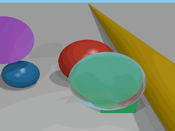
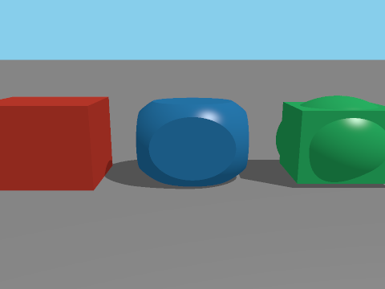
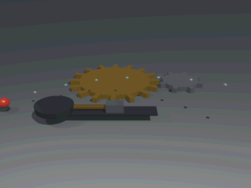
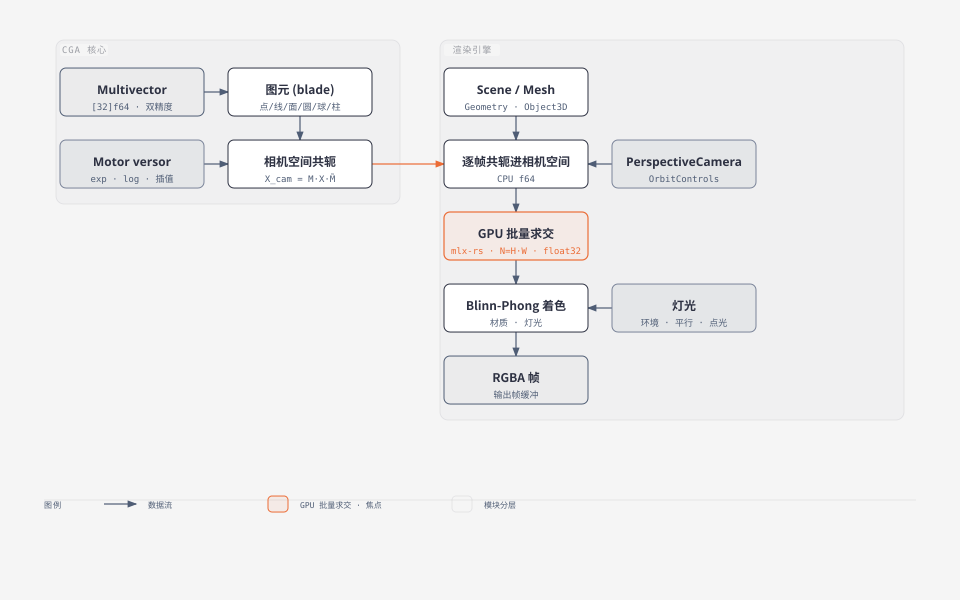
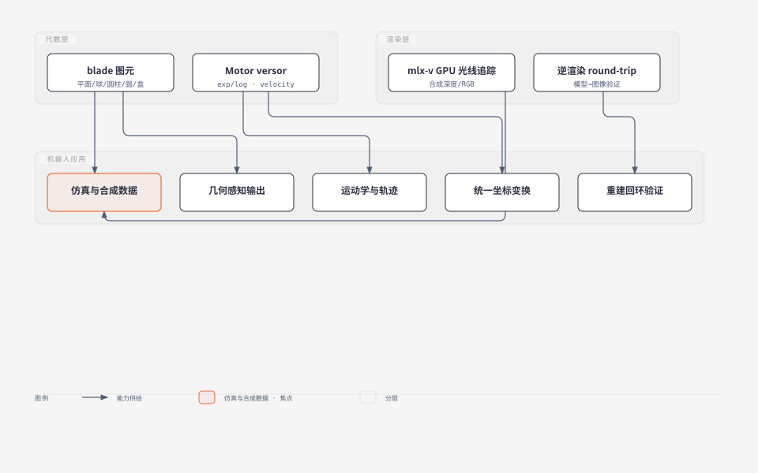

# cga — 共形几何代数 (Conformal Geometric Algebra) 实验场

5D 共形几何代数核心 + three.js 风格渲染引擎 + MLX/Metal GPU 批量光线追踪。
**本项目已整体移植到 Rust**，GPU 计算依赖 [`mlx-rs`](https://github.com/oxideai/mlx-rs)
（Apple MLX 的 Rust 绑定，Metal 后端）；原 V 实现已移除。

把欧氏 3D 空间嵌入共形空间（基 `{e1, e2, e3, e0, e∞}`），点 / 线 / 面 / 圆 /
球与刚体运动 (motor) 统一为代数元素：场景里的每一个对象都是一个 CGA blade，
相机是一次 versor 共轭，渲染就是对 blade 的 GPU 批量求交。

## 渲染结果

`demo_engine` 的轨道动画（地面 + 红/蓝球 + 金柱 + 绿盒 + 紫圆盘 +
折射玻璃球，平行光 + 点光 + 环境光，硬阴影，`aa=2` 超采样抗锯齿）：



重新生成（`encode_gif_rgba` 直接合成 GIF，不落 PNG，见 `crates/cga-core/src/gif.rs`）：

```bash
cargo run --release -p cga-examples --bin demo_engine -- 90
```

## 特性

| 层 | 内容 |
| --- | --- |
| **CGA 核心** | 32 分量 multivector（纯 `[f64; 32]`，CPU 双精度）；Motor versor 变换 (gp/reverse/log/velocity)；exp/log/插值；直接形式 `op` 与对偶形式 `ip` 两种关联判据 |
| **渲染引擎** | three.js 命名 API：Scene / PerspectiveCamera / Mesh / Sphere·Plane·Cylinder·Box·Circle Geometry / MeshStandard Material / Ambient·Directional·Point Light / Renderer.render / OrbitControls；场景对象 = CGA blade，变换 = Motor 共轭；超采样抗锯齿 `renderer(w, h, aa, n)` |
| **复杂建模** | **CSG**（union/difference/intersection 递归真布尔，实体协议 crossings/contains）；**仿射扩展**（scale/mirror 射线逆变换 + Newton 极分解）；**新图元** cone/torus/ellipsoid/cyclide；**网格**（Möller–Trumbore 批量求交 + extrude/loft + OBJ/glTF/GLB 互操作） |
| **MLX GPU** | 每像素向量化解析求交，全分辨率单帧一次 kernel 批量（mlx-rs / Metal）；相机空间 X 右 / Y 下 / Z 前 |

## 快速开始

要求：Rust stable（1.8x+）、macOS Apple Silicon。`mlx-rs` 首次构建会编译
MLX C++ 核心（一次性，约几分钟），之后全部走缓存：

```bash
make test     # cargo test --workspace（128 个测试全过）
make run      # 渲染 smoke 场景 → render_smoke.png
make editor   # 启动 CGS 网页编辑器 → http://127.0.0.1:8123
make fmt      # cargo fmt --all
```

## CGS 场景语言 (OpenSCAD 风格)

`examples/cgs/orbit.cgs`（与上面的演示场景逐位等价，测试有金样断言）：

```text
material(color=0xB0B0B0, roughness=0.7) plane(n=[0, 1, 0], d=0);
translate([0, 1, 0])
  material(color=0xC0392B, roughness=0.25, metalness=0.25) sphere(r=1);

directional_light(direction=[0.4, 1.0, 0.35], intensity=0.38);
camera(fov=50, position=[0, 2.4, 6.2], target=[0, 0.8, 0]);
```

修饰符（`translate`/`rotate`/`scale`/`mirror`/`material`）对紧随的语句或 `{}`
块生效，可嵌套；图元：sphere/plane/cylinder/box/circle/cone/torus/cyclide/
ellipsoid/extrude/loft/mesh。渲染：

```bash
cargo run --release -p cga-examples --bin render_cgs -- examples/cgs/orbit.cgs orbit.png 640 480 2
```

支持变量/表达式/数学函数/for+range/module/if-else/echo，以及 CSG
（union/difference/intersection）；完整语法见 `crates/cga-gpu/src/scene_lang.rs`
文件头注释。示例：`examples/cgs/grid.cgs`（module + for 的 3×3 球阵）、
`examples/cgs/building.cgs`（CSG 开窗建筑）、`examples/cgs/mechanical.cgs`
（CSG 钻孔装配）。

### 实时预览编辑器 (web)

`crates/cga-editor` 是网页版实时预览编辑器（`tiny_http` 服务）：
左侧代码编辑，右侧实时预览（编辑防抖 → `POST /render` → PNG），解析错误返回
HTTP 400 并以红色浮层覆盖预览区提示（Result 式解析，不会崩掉服务）。

- **CGS 语法高亮**：手写词法分析器（`crates/cga-editor/src/highlight.rs`：关键字 / 图元 /
  修饰符 / 函数 / 数字与色值 / 注释 / 运算符）。
- 路由：`GET /`（编辑器页面）、`POST /render?w=&h=&aa=`（CGS→PNG）、
  `GET /health`。

```bash
make editor     # 或：cargo run --release -p cga-editor
# open http://127.0.0.1:8123
```

## 复杂建模能力

面向建筑/机械参数化建模的完整工具链：

**CSG 真布尔** — `difference()` / `intersection()` 递归组合（任意嵌套）：
收集子树全部边界穿越点 → 逐段成员测试（δ 双侧采样）→ 最近实体表面。叶子 =
全部实体图元（sphere/box/cylinder/cone/torus/ellipsoid/extrude/loft/mesh 与
plane 半空间 —— 半空间交 = 剖切视图）：



**建筑：CSG 开窗 + 纹理** — `examples/cgs/building.cgs`：参数化板式办公楼，
砖墙用 `difference()` 开真窗洞，`material(map=...)` 贴砖纹。

**机械：CSG 钻孔装配** — `examples/cgs/mechanical.cgs`：法兰螺栓节圆阵列真钻孔 +
中心孔、沉头锥孔、环面垫圈、径向齿阵列。

**新图元** — cone（凸体区间裁剪）/ torus（Durand-Kerner 复数迭代解四次方程）/
ellipsoid（= 仿射缩放球）/ **cyclide**（Dupin cyclide，四次曲面，Durand-Kerner
求根）。四者非 CGA blade，经射线逆变换接入；cyclide 模型见
`crates/cga-core/src/cyclide.rs`。

**仿射扩展** — scale/mirror 经 AffineGeometry 射线逆变换（非 versor 可达；法向
走逆置变换，det<0 镜像自动正确）。上下文为全 4×4 仿射，几何落点 Newton 极分解
为 motor·linear，rotate 与 scale/mirror 任意嵌套顺序均正确。

**网格与互操作** — MeshGeometry（Möller–Trumbore 批量求交，平坦法向，无 BVH）；
`modeling.rs` 的 extrude（耳切凹轮廓三角化）与 loft（等点数多截面）；
`mesh_io.rs` 纯 stdlib OBJ 读写，`mesh_io_gltf.rs` glTF/GLB 读写
（节点变换/层级/材质色）。

**精度** — 代数核心（multivector/motor/图元）是纯 CPU `[f64; 32]` 双精度，
远原点 conformal 抵消不受 float32 精度限制。渲染内核仍是 float32
（MLX/Metal 无 float64，参数进相机空间后 near-origin）。

**运动学** — `demo_kinematics`：齿轮副（16:8 齿数比 → 角速度比精确
−1:2）、曲柄滑块、螺旋轨迹 `M(s) = M₀·exp(s·log(M₀⁻¹M₁))` —— 全部 Motor 直写，
无矩阵分解/四元数换算层，直接合成 `examples/kinematics/kinematics.gif`（不落 PNG）：



## 场景代码

```rust
use cga_core::*;
use cga_gpu::*;

let mut scene = scene(None);
scene.add_mesh(mesh(MeshParams {
    geometry: Geometry::PlaneGeometry(plane_geometry([0.0, 1.0, 0.0], 0.0)),
    material: standard_material(MaterialParams {
        color: color_hex(0xB0B0B0), roughness: 0.7, metalness: 0.0,
        emissive: color_hex(0x000000), opacity: 1.0, ior: 1.5, absorption: 0.0,
    }),
    position: [0.0, 0.0, 0.0], rotation_axis: [0.0, 0.0, 1.0],
    rotation_angle: 0.0, motor: None,
}));                                          // 地面: 对偶平面 blade (y=0)
scene.add_mesh(mesh(MeshParams {
    geometry: Geometry::SphereGeometry(sphere_geometry(1.0)),
    material: standard_material(MaterialParams {
        color: color_hex(0xC0392B), roughness: 0.25, metalness: 0.25,
        emissive: color_hex(0x000000), opacity: 1.0, ior: 1.5, absorption: 0.0,
    }),
    position: [0.0, 1.0, 0.0], rotation_axis: [0.0, 0.0, 1.0],
    rotation_angle: 0.0, motor: None,
}));                                          // 球: 对偶球 blade, 半径即尺寸
scene.add_light(directional_light(color_hex(0xFFFFFF), 0.38, [0.4, 1.0, 0.35]));
scene.add_light(ambient_light(color_hex(0xFFFFFF), 0.34));

let mut camera = perspective_camera(50.0, 4.0 / 3.0, 0.1, 100.0,
    [0.0, 2.4, 6.2], [0.0, 0.8, 0.0], [0.0, 1.0, 0.0]);
camera.look_at([0.0, 0.8, 0.0], None);

let mut renderer = renderer(360, 270, 2, 3);
let img = renderer.render(scene, camera);       // (H, W, 4) uint8 RGBA
save_frame_png("out.png", &img);
```

（精确签名见 `crates/cga-gpu/src/scene.rs` / `renderer.rs` / `shading.rs`。）

## 架构



关键设计：图元级（blade）建模而非三角网格 —— 球/圆柱没有细分数，尺寸全部在
geometry 构造参数里；像素级计算全部在 mlx-rs GPU 上批量进行，Rust 层每帧只循环
图元（~10 个）。代数核心跑在 CPU 的 `[f64; 32]` 上（比 float32 更准），
`mlx-rs` 只用在逐像素渲染内核（`renderer.rs` / `geometry_ops.rs` / `shading.rs`），
标量助手 `s_add`/`s_mul`/`s_clip`… 自由函数由 `mlxops.rs` 提供。

## CGA 建模 vs 传统欧氏建模（渲染视角）

| 维度 | 传统欧氏建模 (three.js/网格) | 本项目 CGA 建模 |
| --- | --- | --- |
| **几何表示** | 三角网格：球/圆柱靠细分数逼近，永远是多边形近似 | 隐式 blade：球/圆柱/平面/圆/盒的解析方程，精确无细分数 |
| **尺寸/精度** | 细分数决定精度与内存；距离近了能看到面片棱角 | 尺寸 = geometry 构造参数（如 `sphere_geometry(1.0)`），任意距离渲染一致 |
| **变换机制** | 4×4 矩阵（平移+旋转分算），连乘浮点误差破坏正交性 | Motor versor 共轭 `X' = M·X·M̃`；任意 motor 乘积仍是 motor，逆 = reverse |
| **相机** | 独立的 view/projection 矩阵 | 相机 pose 也是 Motor，与物体变换同机制 |
| **渲染管线** | 光栅化：顶点着色器投影 → 片段插值 → z-buffer | 光线追踪：每像素对 blade 解析求交，mlx-rs GPU 逐像素批量 |
| **统一性** | 几何、变换、渲染是三套独立机制 | 点/线/面/圆/球与刚体运动同属一个 5D 代数，关联判据 op/ip、求交 meet 统一 |
| **动画/插值** | 矩阵无直接插值语义，需分解位置+四元数 | `Motor.exp/log`：直接插值 motor、提取速度二重向量 |

实际后果：

- **球/圆柱无多边形** —— 渲染质量不随相机距离恶化；代价是隐式几何没有顶点/拓扑，
  网格编辑类建模工具用不上。
- **无限几何天然成立** —— 无限平面、无限圆柱是代数对象本身的属性，无需裁剪。
- **变换与几何同构** —— motor 与 blade 是同一类对象，没有矩阵-四元数-轴角换算层。
- **代价在别处** —— 解析求交的渲染内核仍是 float32；有限圆柱带端盖；无限圆柱/平面
  在相机位于退化位形时需内核特殊处理。

## 范围声明 (与 three.js 的差距)

如实标注：

- 阴影：每光源一条遮挡射线（硬阴影）；无软阴影。无后处理 / tonemap。
- 纹理：`material(map=...)` 解析 UV；无 mipmap/过滤控制。
- scale/mirror：经 AffineGeometry 射线逆变换（非 versor 可达）；blade 语义
  （meet/关联判据）不适用于仿射形变后的图元。
- CSG：相切/共面退化配置依赖 δ=1e-4 双侧采样；CSG 节点单材质；circle 非实体。
- cone/torus/ellipsoid/cyclide/网格非 CGA blade，经射线逆变换接入。
- cyclide：环型 (c<d<a) 是光滑亏格-1 曲面；尖型自交，CSG 成员性语义退化。
- 网格：暴力 O(N·F) 无 BVH；平坦法向；无纹理坐标；glTF 导入暂限单 primitive。
- 精度：代数核心恒为 CPU float64；渲染内核 float32。
- 无 envMap/IBL：高 metalness 材质会显黑，demo 因此压低金属度。

## 机器人领域潜在应用

CGA 建模 + Motor + GPU 光线追踪 + 逆渲染回环：



- **仿真与合成数据**：光线追踪合成深度/RGB，逐像素 GPU 批量，改视角只需重设相机
  Motor —— 适合感知训练数据的域随机化批量生成（带精确深度真值）。
- **运动学与轨迹**：Motor 是 SE(3) 的 versor 表示，已有 `exp`/`log`/
  `velocity_bivector`/`interpolate`；`motor = exp(s·log(M₀·M₁⁻¹))` 生成平滑刚体
  路径，无需矩阵分解。
- **几何感知输出**：图元 blade 本身就是操作对象语义（平面法向 = 抓取姿态 z 轴、
  圆柱轴线+半径 = 夹爪开度）。
- **重建回环验证**：重建的 blade 场景渲染回原视角（`renderer.rs`），与原帧深度对比
  发现漂移。
- **统一坐标变换**：相机、机械臂、工件全用同一代数，多坐标系链式变换收敛到一个
  表示。

## 项目布局

```text
Cargo.toml                 # workspace（4 个 crate）
crates/
  cga-core/                # 纯 f64 CPU 代数核心（原 V `cga` 模块）
    src/multivector.rs     32 分量多重向量 (gp/ip/op/reverse/dual/meet/norm)
    src/tables.rs          GP 积表（由 gen_tables.py 从积表定义重新生成）
    gen_tables.py          积表生成器（一次性脚本，输出 tables.rs）
    src/motors.rs          Motor: rotor/translator/exp/log/interpolate/velocity
    src/primitives.rs      图元: point/point_pair/line/plane/sphere/circle/cylinder + 距离
    src/cyclide.rs         Dupin cyclide 模型（球族包络 + versor 反演）
    src/geometry.rs        Geometry 类型 + 相机空间参数结构
    src/affine.rs + affine_geom.rs
                           仿射扩展（scale/mirror 射线逆变换 + Newton 极分解）
    src/csg_node.rs        CSG 树节点（union/difference/intersection）
    src/modeling.rs        耳切三角化 + extrude + loft
    src/mesh_io.rs         OBJ 读写 + 4x4 矩阵助手
    src/gif.rs             动画 GIF89a 编码（中位切分配色 + LZW，纯 stdlib）
  cga-gpu/                 # mlx-rs/Metal GPU 内核（原 V `cga_gpu` 模块）
    src/mlxops.rs          标量广播助手（fs/s_add/s_clip/…，原 mlx_ops 模块）
    src/scene_graph.rs     Vec3/Color/Object3D
    src/scene.rs           Mesh/Scene/PerspectiveCamera/OrbitControls
    src/geometry_ops.rs + geometry_extra.rs + geom_kernels.rs
                           blade 几何批量解析求交（含 cone/torus/ellipsoid/cyclide）
    src/trimesh.rs         Möller–Trumbore 批量网格求交
    src/csg.rs             递归 CSG 布尔（crossings/contains 实体协议）
    src/shading.rs         材质/灯光 + 批量 Blinn-Phong
    src/texture.rs         纹理解码 + bilinear map 采样
    src/image_io.rs        PNG 读写（image crate）
    src/renderer.rs        mlx-rs GPU 批量光线追踪（SSAA/硬阴影/Whitted 折射）
    src/mesh_raster.rs     CPU 网格光栅化（与光线追踪层深度合成）
    src/mesh_io_gltf.rs    glTF/GLB 读写（save_glb / load_gltf）
    src/scene_lang.rs      CGS 场景语言（lexer + 单遍 parser/evaluator）
  cga-editor/              CGS 网页编辑器（tiny_http server + web/ 资源内嵌）
  cga-examples/            演示 CLI（src/bin/*.rs，见下）
examples/                  .cgs 示例 (cgs/orbit/grid/building/mechanical) + cgs/assets/ 纹理
                           + 各 demo 输出金样图（README 插图）
artifacts/tests/           测试金样图（cgs_orbit / cone / cyclide / ...，gitignored）
docs/                      架构图 / 机器人应用图 (svg)
```

演示 CLI（`cargo run --release -p cga-examples --bin <name>`）：

- `demo_engine` —— 轨道动画 → `examples/engine/orbit.gif`（可选帧数参数，默认 90）
- `demo_advantage` —— 无多边形/无限几何/变换同构三面板 → `advantage_{a,b,c}.png`
- `demo_kinematics` —— 齿轮副/曲柄滑块/螺旋插值 → `examples/kinematics/kinematics.gif`
- `demo_csg` —— difference/intersection/union 并排 → `examples/csg/demo_csg.png`
- `demo_gltf` —— extrude L 形 → 存 `.glb` → 重载 → 渲染 → `demo_gltf.{glb,png}`
- `demo_helmet` —— DamagedHelmet.glb 加载渲染 → `examples/helmet/demo_helmet.png`
- `render_cgs <file.cgs> [out.png] [w h aa]` —— CGS→PNG CLI

## 质量

- `make test`（`cargo test --workspace`）：128 个测试全过 —— 代数恒等式 /
  图元关联判据 / versor 往返 / exp-log 往返 / 距离公式 / 抗锯齿 / 引擎渲染定量 /
  CSG 布尔 / 仿射 / 新图元 / cyclide / 网格与互操作 / CGS / 位移曲面烘焙 /
  编辑器 highlight（cga-core 39 + cga-gpu 82 + cga-editor 7）。
- 测试会把渲染金样图写到 `artifacts/tests/`（cgs_orbit / cone / cyclide /
  ellipsoid / sphere / textured_box / torus / trimesh）。
- 渲染结果与原 V 实现逐像素一致（sphere/cone/ellipsoid/cyclide/torus/textured_box/
  helmet/csg 金样 RMSE = 0）。

## License

MIT，见 [LICENSE](LICENSE)。
