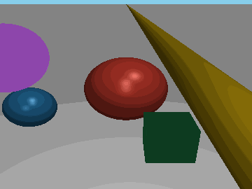
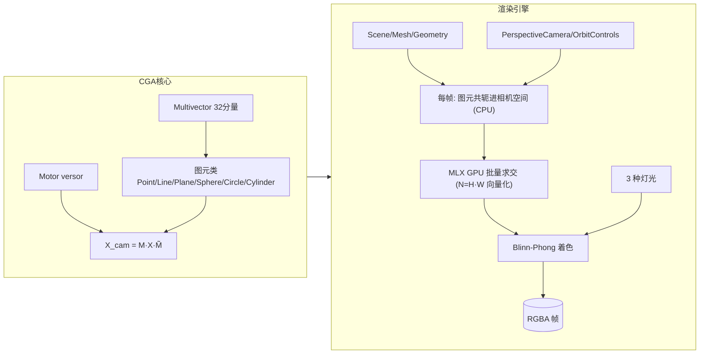
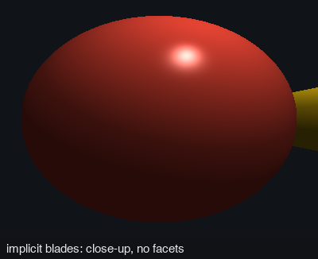
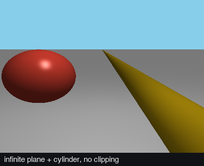
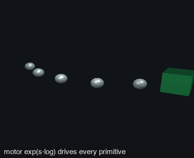

# cga — 共形几何代数 (Conformal Geometric Algebra) 实验场

5D 共形几何代数核心 + three.js 风格渲染引擎 + MLX/Metal GPU 批量光线追踪。

把欧氏 3D 空间嵌入共形空间 (基 `{e1, e2, e3, e0, e∞}`), 点 / 线 / 面 / 圆 / 球与刚体
运动 (motor) 统一为代数元素: 场景里的每一个对象都是一个 CGA blade, 相机是一次
versor 共轭, 渲染就是对 blade 的 GPU 批量求交。

## 渲染结果

`demo_engine.py` 的轨道动画 (90 帧, 50ms/帧, 360×270): 地面 + 红/蓝球 + 金柱 +
绿盒 + 紫圆盘, 平行光 + 点光 + 正面补光 + 环境光, OrbitControls 环绕一周:



重新生成: `uv run python demo_engine.py 90` (默认输出到 `artifacts/`)。

## 特性

| 层 | 内容 |
| --- | --- |
| **CGA 核心** | 32 分量 multivector; 图元类 Point / PointPair / Line / Plane / Sphere / Circle / Cylinder; Motor versor 变换 (gp/reverse/log/velocity_bivector); exp/log/插值; 直接形式 `op` 与对偶形式 `ip` 两种关联判据 |
| **渲染引擎** | three.js 命名 API: Scene / PerspectiveCamera / Mesh / Sphere·Plane·Cylinder·Box·Circle Geometry / MeshBasic·Standard Material / Ambient·Directional·Point Light / Renderer.render / OrbitControls; 场景对象 = CGA blade, 变换 = Motor 共轭 (相机也是 Motor) |
| **MLX GPU** | 每像素向量化解析求交 (5 种隐式几何), 全分辨率单帧一次 kernel 批量; 相机空间 X 右 / Y 下 / Z 前 |

## 快速开始

```bash
uv run python demo_engine.py 90        # 渲染轨道动画 → artifacts/orbit.gif
uv run python -m cga                   # 包自检: 57 项断言 (代数/图元/versor/距离)
```

## 场景代码

```python
from cga.engine import *

scene = Scene()
scene.add(
    Mesh(PlaneGeometry((0, 1, 0), 0.0),             # 地面: 对偶平面 blade (y=0)
         MeshStandardMaterial(Color(0xB0B0B0), roughness=0.7)),
    Mesh(SphereGeometry(1.0),                        # 球: 对偶球 blade, 半径即尺寸
         MeshStandardMaterial(Color(0xC0392B), roughness=0.25, metalness=0.25),
         position=(0, 1, 0)),
    Mesh(BoxGeometry(0.9, 0.9, 0.9),                 # 盒: 3 对平面 slab
         MeshStandardMaterial(Color(0x27AE60), roughness=0.6),
         position=(0.8, 0.45, 1.8)),
    DirectionalLight(intensity=0.38, direction=(0.4, 1.0, 0.35)),  # 主光
    PointLight(intensity=0.7, position=(0, 4, 3.5)),
    AmbientLight(intensity=0.34),
)

camera = PerspectiveCamera(fov=50, aspect=4 / 3, position=(0, 2.4, 6.2), target=(0, 0.8, 0))
camera.look_at((0, 0.8, 0))
controls = OrbitControls(camera, target=(0, 0.8, 0), radius=6.6, elevation=0.42)
controls.azimuth = 2 * 3.14159 * 0.5   # 半圈
controls.update()

renderer = Renderer(360, 270)
img = renderer.render(scene, camera)    # (H, W, 4) uint8 RGBA
```

## 架构



关键设计: 图元级 (blade) 建模而非三角网格 —— 球/圆柱没有细分数, 尺寸全部在
geometry 构造参数里; 像素级计算全部在 MLX GPU 上批量进行, Python 层每帧只循环
图元 (~10 个)。

## CGA 建模 vs 传统欧氏建模（渲染视角）

本项目的建模方式与传统欧氏引擎 (three.js + 三角网格 + 矩阵变换) 有根本区别:

| 维度 | 传统欧氏建模 (three.js/网格) | 本项目 CGA 建模 |
| --- | --- | --- |
| **几何表示** | 三角网格: 球/圆柱靠细分数逼近, 永远是多边形近似 | 隐式 blade: 球/圆柱/平面/圆/盒的解析方程, 精确无细分数 |
| **尺寸/精度** | 细分数决定精度与内存; 距离近了能看到面片棱角 | 尺寸 = geometry 构造参数 (如 `SphereGeometry(1.0)`), 任意距离渲染一致 |
| **变换机制** | 4×4 矩阵 (平移+旋转分算), 连乘浮点误差破坏正交性, 需重新正交化 | Motor versor 共轭 `X' = M·X·M̃`; 任意 motor 乘积仍是 motor (刚体保真), 逆 = reverse |
| **相机** | 独立的 view/projection 矩阵, 与物体变换机制分离 | 相机 pose 也是 Motor, 与物体变换同机制 (`X_cam = M_cam·X·M̃_cam`) |
| **渲染管线** | 光栅化: 顶点着色器投影 → 片段插值 → z-buffer | 光线追踪: 每像素对 blade 解析求交 (ray-sphere 二次 / ray-plane 一次 / ray-cylinder 二次 / 盒 slab 法), MLX GPU 逐像素批量 |
| **统一性** | 几何、变换、渲染是三套独立机制 | 点/线/面/圆/球与刚体运动同属一个 5D 代数 (都是 multivector), 关联判据 op/ip、求交 meet 统一 |
| **动画/插值** | 矩阵无直接插值语义, 需分解位置+四元数 | `Motor.exp/log`: 可直接插值 motor、提取速度二重向量 (运动学闭环) |

这带来几个实际后果:

- **球/圆柱无多边形** —— 渲染质量不随相机距离恶化, 近看不会暴露三角面片; 代价是隐式几何没有顶点/拓扑, 网格编辑类建模工具 (细分、挤出) 用不上。
- **无限几何天然成立** —— 无限平面 (地平线无限延伸)、无限圆柱是代数对象本身的属性, 无需裁剪; 想要有限片状面需自行按区域掩码裁剪 (见 `cga/render.py`)。
- **变换与几何同构** —— motor 与 blade 是同一类对象, `Motor.compose` / `inverse` / `log` 直接作用于任何图元, 没有矩阵-四元数-轴角之间的换算层。
- **代价在别处** —— 解析求交的 float32 blade 共轭限制场景尺度 (坐标宜 ±20 内); 无纹理坐标概念 (v1 无纹理); 无限平面/圆柱在相机位于退化位形时需内核特殊处理 (见下节)。

### 渲染示例: 三个优势的可视化

`demo_advantage.py` 把上面三个实际后果各渲染成一张独立图像
(`uv run python demo_advantage.py` → `artifacts/advantage_{a,b,c}.png`):

**无多边形** — 相机贴脸 (≈2.7× 半径) 的大球 + 无限圆柱: 轮廓是完美圆弧、
高光无棱角; 同等距离的网格球/圆柱已能看到三角面片棱角。



**无限几何** — 地面是无限平面 (直达地平线不裁剪), 金柱是无限圆柱
(无顶/底盖), 红球作尺度参照 (底切正好在地面)。



**变换与几何同构** — 同一个 Motor 沿 `exp(s·log(M0⁻¹M1))` 插值
(SE(3) 螺旋), 一路驱动 6 个小球轨迹图元; 终点绿盒的旋转也由同一
motor 给出 —— 无矩阵分解、无位置/四元数换算层。



## 范围声明 (v1 与 three.js 的差距)

如实标注, 见 `cga/engine.py` 顶部注释:

- 无阴影 / 纹理 / 后处理 / tonemap; 颜色线性 I/O, 不做 sRGB 编码。
- Object3D 无 scale: motor 是刚体变换, 尺寸全走 geometry 参数。
- 无限平面 / 圆柱无面片裁剪; 相机在柱内等退化情形按内核处理。
- float32: blade 共轭在 float32 下进行, 场景坐标宜控制在 ±20 内 (远原点
  conformal 抵消是本包已知限制)。
- 无 envMap/IBL: 高 metalness 材质会显黑 (three.js 同样问题), demo 因此压低金属度。

## 机器人领域潜在应用

CGA 建模 + Motor + GPU 光线追踪 + 逆渲染回环, 四条能力线分别对机器人
的仿真、运动学、感知与验证需求:


### 仿真与合成数据

光线追踪合成深度图/RGB, **逐像素 GPU 批量** (H×W 一次 kernel), 改视角只需
重设相机 Motor (OrbitControls/相机共轭) —— 适合感知训练数据的域随机化批量
生成 (带精确深度真值), 以及解析求交的仿真传感器 (比光栅化深度更准, 无面片
误差)。

> 诚实标注: v1 无阴影/纹理/物理光照, 做视觉训练数据可用, 照片级仿真需扩展。

### 运动学与轨迹

Motor 是 SE(3) 的 versor 表示, 本包已有 `exp` / `log` / `velocity_bivector` /
`compose` / `inverse`:

- **Cartesian 轨迹插值**: `motor = exp(s·log(M₀·M₁⁻¹))` 生成平滑刚体路径
  (机械臂末端/移动底座), 无需矩阵分解成平移+四元数。
- **Twist 提取**: `velocity_bivector` 直接给速度二重向量 (6-DOF 旋量),
  控制律 (导纳/阻抗) 的关节空间映射上游。
- **手眼标定**: AX=XB 的 A/X/B 全是 motor, 同一代数免来回转换。
- **刚体保真**: motor 连乘不破坏正交性 (vs 4×4 矩阵浮点漂移),
  长链变换 (base→tool→camera) 不累积退化。

### 几何感知输出

图元 blade 本身就是机器人的操作对象语义 (感知前端的平面/圆柱拟合与深度
估计在配套仓库, 导出为米制 SceneModel 衔接):

- **平面** (桌面/墙/货架面/传送带): 法向即抓取/放置姿态 z 轴, 米制 blade + 协方差直接进操作规划。
- **圆柱** (管件/瓶罐/轴): 轴线 + 半径 = 抓取中心与夹爪开度参数。
- **球** (球体工件) / **圆** (开口、法兰、孔): 近圆目标识别与对准。
- 逆渲染 (`cga/render.py`) 把模型渲染回 2D 核对重建质量 —— 感知闭环可信度机制。

### 重建回环验证

模型→图像 round-trip 是重建系统少见的闭环检查: 重建的 blade 场景渲染回原
视角, 与原帧深度对比可发现漂移; novel-view 预览给操作规划做预期视图。

### 统一坐标变换

相机、机械臂、工件全用同一代数: `X_cam = M_cam·X·M̃_cam` 与
`X_base = M_tool·X` 无机制差异 —— 多坐标系链式变换、手眼标定、双相机几何
收敛到一个表示, 减少跨库转换 bug。

## 项目布局

```
cga/
  multivector.py   32 分量多重向量, 代数运算 (gp/ip/op/dual/meet/norm/...)
  algebra.py       图元类与距离 (直接/对偶两种形式)
  motors.py        Motor: 刚体变换 versor, exp/log/插值/速度提取
  engine.py        three.js 风格渲染引擎 (MLX 批量光线追踪)
  render.py        逆渲染: SceneModel → 2D 深度/颜色 (反投影工具)
  compare_clifford.py  与 clifford 库的数值对比 (可选依赖)
  __main__.py      包自检: python -m cga (57 项断言)
demo_engine.py     轨道动画 demo → PNG 帧 + GIF
demo_advantage.py   优势渲染 demo → 无多边形/无限几何/motor 插值三张独立图
```

## 质量

- `python -m cga`: 57 项自检全过 (代数恒等式 / 图元关联判据 / versor 往返 /
  exp-log 往返 / 距离公式, 见 `cga/__main__.py`)。
- ruff (E/F/I/UP) 与 pyright (strict) 零告警。

## License

MIT, 见 [LICENSE](LICENSE)。
