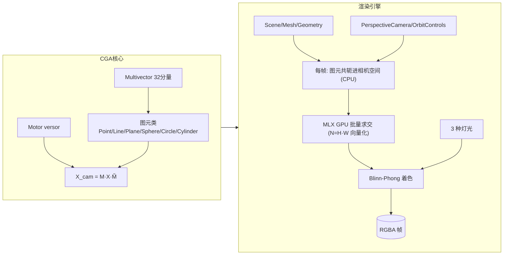
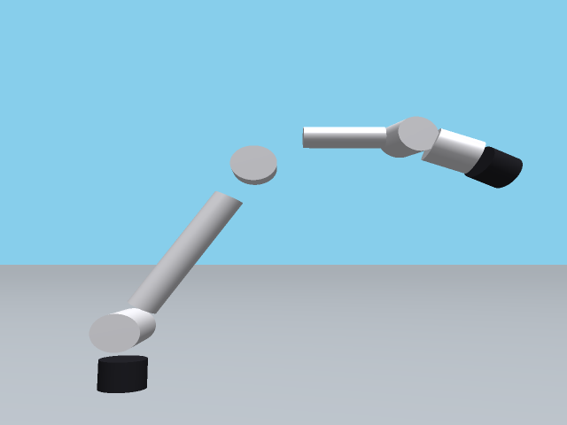
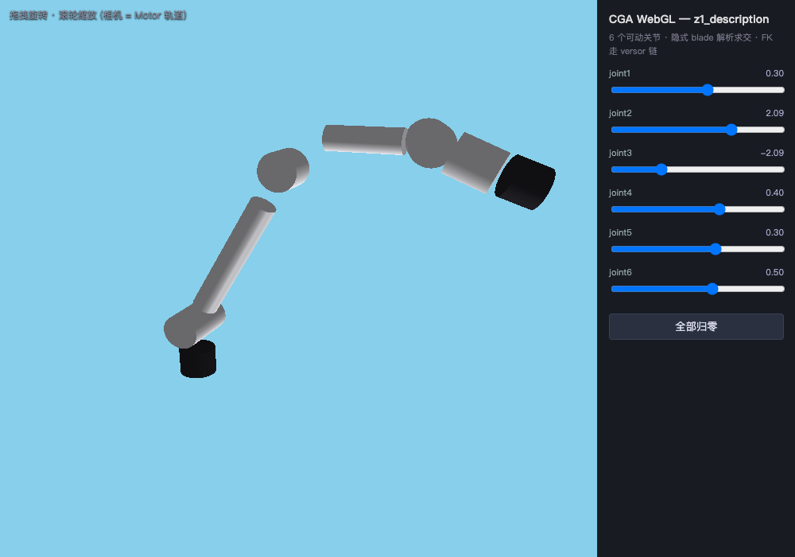
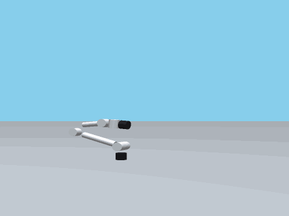
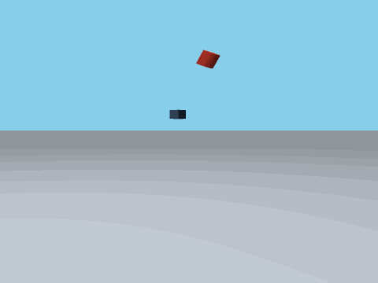
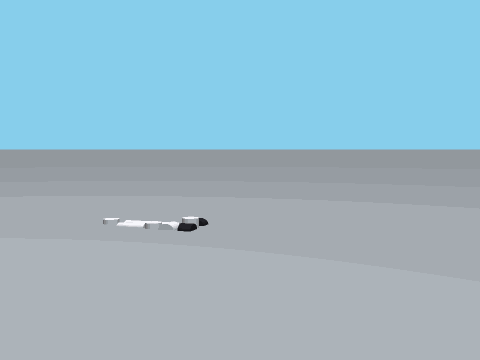
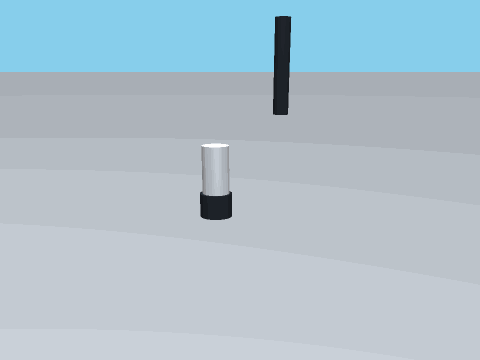
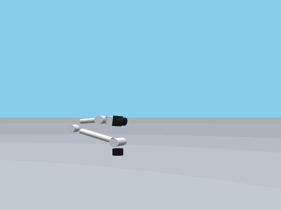

# cga — 共形几何代数 (Conformal Geometric Algebra) 实验场

5D 共形几何代数核心 + three.js 风格渲染引擎 + MLX/Metal GPU 批量光线追踪。

把欧氏 3D 空间嵌入共形空间 (基 `{e1, e2, e3, e0, e∞}`), 点 / 线 / 面 / 圆 / 球与刚体
运动 (motor) 统一为代数元素: 场景里的每一个对象都是一个 CGA blade, 相机是一次
versor 共轭, 渲染就是对 blade 的 GPU 批量求交。

## 渲染结果

`demo_engine.py` 的轨道动画 (90 帧, ~30ms/帧, 360×270, `aa=2` 超采样抗锯齿):
地面 + 红/蓝球 + 金柱 + 绿盒 + 紫圆盘, 平行光 + 点光 + 正面补光 + 环境光,
OrbitControls 环绕一周:


重新生成: `uv run python demo_engine.py 90` (默认输出到 `artifacts/`)。

## 特性

| 层 | 内容 |
| --- | --- |
| **CGA 核心** | 32 分量 multivector; 图元类 Point / PointPair / Line / Plane / Sphere / Circle / Cylinder; Motor versor 变换 (gp/reverse/log/velocity_bivector); exp/log/插值; 直接形式 `op` 与对偶形式 `ip` 两种关联判据 |
| **渲染引擎** | three.js 命名 API: Scene / PerspectiveCamera / Mesh / Sphere·Plane·Cylinder·Box·Circle Geometry / MeshBasic·Standard Material / Ambient·Directional·Point Light / Renderer.render / OrbitControls; 场景对象 = CGA blade, 变换 = Motor 共轭 (相机也是 Motor); 超采样抗锯齿 `Renderer(aa=N)` (每像素 N×N 条亚像素射线平均) |
| **MLX GPU** | 每像素向量化解析求交 (5 种隐式几何), 全分辨率单帧一次 kernel 批量; 相机空间 X 右 / Y 下 / Z 前 |

## 快速开始

```bash
uv run python demo_engine.py 90        # 渲染轨道动画 → artifacts/orbit.gif
uv run python -m cga                   # 包自检: 101 项断言 (代数/图元/versor/距离/动力学/接触/浮动基座/隐式接触/积分器/prismatic/传感器/systems)
```

## 场景代码

```python
from cga.engine import *

scene = Scene()
scene.add(
    Mesh(PlaneGeometry((0, 1, 0), 0.0),             # 地面: 对偶平面 blade (y=0)
         MeshStandardMaterial(Color(0xB0B0B0), roughness=0.7)),
    Mesh(SphereGeometry(1.0),                        # 球: 对偶球 blade, 半径即尺寸
         MeshStandardMaterial(Color(0xC0392B), roughness=0.25, metalness=0.25),
         position=(0, 1, 0)),
    Mesh(BoxGeometry(0.9, 0.9, 0.9),                 # 盒: 3 对平面 slab
         MeshStandardMaterial(Color(0x27AE60), roughness=0.6),
         position=(0.8, 0.45, 1.8)),
    DirectionalLight(intensity=0.38, direction=(0.4, 1.0, 0.35)),  # 主光
    PointLight(intensity=0.7, position=(0, 4, 3.5)),
    AmbientLight(intensity=0.34),
)

camera = PerspectiveCamera(fov=50, aspect=4 / 3, position=(0, 2.4, 6.2), target=(0, 0.8, 0))
camera.look_at((0, 0.8, 0))
controls = OrbitControls(camera, target=(0, 0.8, 0), radius=6.6, elevation=0.42)
controls.azimuth = 2 * 3.14159 * 0.5   # 半圈
controls.update()

renderer = Renderer(360, 270)
img = renderer.render(scene, camera)    # (H, W, 4) uint8 RGBA
```

## 架构



关键设计: 图元级 (blade) 建模而非三角网格 —— 球/圆柱没有细分数, 尺寸全部在
geometry 构造参数里; 像素级计算全部在 MLX GPU 上批量进行, Python 层每帧只循环
图元 (~10 个)。

## CGA 建模 vs 传统欧氏建模（渲染视角）

本项目的建模方式与传统欧氏引擎 (three.js + 三角网格 + 矩阵变换) 有根本区别:

| 维度 | 传统欧氏建模 (three.js/网格) | 本项目 CGA 建模 |
| --- | --- | --- |
| **几何表示** | 三角网格: 球/圆柱靠细分数逼近, 永远是多边形近似 | 隐式 blade: 球/圆柱/平面/圆/盒的解析方程, 精确无细分数 |
| **尺寸/精度** | 细分数决定精度与内存; 距离近了能看到面片棱角 | 尺寸 = geometry 构造参数 (如 `SphereGeometry(1.0)`), 任意距离渲染一致 |
| **变换机制** | 4×4 矩阵 (平移+旋转分算), 连乘浮点误差破坏正交性, 需重新正交化 | Motor versor 共轭 `X' = M·X·M̃`; 任意 motor 乘积仍是 motor (刚体保真), 逆 = reverse |
| **相机** | 独立的 view/projection 矩阵, 与物体变换机制分离 | 相机 pose 也是 Motor, 与物体变换同机制 (`X_cam = M_cam·X·M̃_cam`) |
| **渲染管线** | 光栅化: 顶点着色器投影 → 片段插值 → z-buffer | 光线追踪: 每像素对 blade 解析求交 (ray-sphere 二次 / ray-plane 一次 / ray-cylinder 二次 / 盒 slab 法), MLX GPU 逐像素批量 |
| **统一性** | 几何、变换、渲染是三套独立机制 | 点/线/面/圆/球与刚体运动同属一个 5D 代数 (都是 multivector), 关联判据 op/ip、求交 meet 统一 |
| **动画/插值** | 矩阵无直接插值语义, 需分解位置+四元数 | `Motor.exp/log`: 可直接插值 motor、提取速度二重向量 (运动学闭环) |

这带来几个实际后果:

- **球/圆柱无多边形** —— 渲染质量不随相机距离恶化, 近看不会暴露三角面片; 代价是隐式几何没有顶点/拓扑, 网格编辑类建模工具 (细分、挤出) 用不上。
- **无限几何天然成立** —— 无限平面 (地平线无限延伸)、无限圆柱是代数对象本身的属性, 无需裁剪; 想要有限片状面需自行按区域掩码裁剪 (见 `cga/render.py`)。
- **变换与几何同构** —— motor 与 blade 是同一类对象, `Motor.compose` / `inverse` / `log`
  直接作用于任何图元, 没有矩阵-四元数-轴角之间的换算层。
- **代价在别处** —— 解析求交的 float32 blade 共轭限制场景尺度 (坐标宜 ±20 内);
  无纹理坐标概念 (v1 无纹理); 有限圆柱经 `CylinderGeometry(length=...)`
  带端盖, 无限圆柱/平面在相机位于退化位形时需内核特殊处理 (见下节)。

### 渲染示例: 三个优势的可视化

`demo_advantage.py` 把上面三个实际后果各渲染成一张独立图像
(`uv run python demo_advantage.py` → `artifacts/advantage_{a,b,c}.png`, 均以
`aa=2` 超采样抗锯齿渲染, 轮廓无锯齿):

**无多边形** — 相机贴脸 (≈2.7× 半径) 的大球 + 无限圆柱: 轮廓是完美圆弧、
高光无棱角; 同等距离的网格球/圆柱已能看到三角面片棱角。


**无限几何** — 地面是无限平面 (直达地平线不裁剪), 金柱是无限圆柱
(无顶/底盖), 红球作尺度参照 (底切正好在地面)。


**变换与几何同构** — 同一个 Motor 沿 `exp(s·log(M0⁻¹M1))` 插值
(SE(3) 螺旋), 一路驱动 6 个小球轨迹图元; 终点绿盒的旋转也由同一
motor 给出 —— 无矩阵分解、无位置/四元数换算层。


## 范围声明 (v1 与 three.js 的差距)

如实标注, 见 `cga/engine.py` 顶部注释:

- 无阴影 / 纹理 / 后处理 / tonemap; 颜色线性 I/O, 不做 sRGB 编码。
- Object3D 无 scale: motor 是刚体变换, 尺寸全走 geometry 参数。
- 无限平面 / 圆柱无面片裁剪; 相机在柱内等退化情形按内核处理。
- float32: blade 共轭在 float32 下进行, 场景坐标宜控制在 ±20 内 (远原点
  conformal 抵消是本包已知限制)。
- 无 envMap/IBL: 高 metalness 材质会显黑 (three.js 同样问题), demo 因此压低金属度。

## 机器人领域潜在应用

CGA 建模 + Motor + GPU 光线追踪 + 逆渲染回环, 四条能力线分别对机器人
的仿真、运动学、感知与验证需求:


### 仿真与合成数据

光线追踪合成深度图/RGB, **逐像素 GPU 批量** (H×W 一次 kernel), 改视角只需
重设相机 Motor (OrbitControls/相机共轭) —— 适合感知训练数据的域随机化批量
生成 (带精确深度真值), 以及解析求交的仿真传感器 (比光栅化深度更准, 无面片
误差)。

> 诚实标注: v1 无阴影/纹理/物理光照, 做视觉训练数据可用, 照片级仿真需扩展。

### 运动学与轨迹

Motor 是 SE(3) 的 versor 表示, 本包已有 `exp` / `log` / `velocity_bivector` /
`compose` / `inverse`:

- **Cartesian 轨迹插值**: `motor = exp(s·log(M₀·M₁⁻¹))` 生成平滑刚体路径
  (机械臂末端/移动底座), 无需矩阵分解成平移+四元数。
- **Twist 提取**: `velocity_bivector` 直接给速度二重向量 (6-DOF 旋量),
  控制律 (导纳/阻抗) 的关节空间映射上游。
- **手眼标定**: AX=XB 的 A/X/B 全是 motor, 同一代数免来回转换。
- **刚体保真**: motor 连乘不破坏正交性 (vs 4×4 矩阵浮点漂移),
  长链变换 (base→tool→camera) 不累积退化。

### 几何感知输出

图元 blade 本身就是机器人的操作对象语义 (感知前端的平面/圆柱拟合与深度
估计在配套仓库, 导出为米制 SceneModel 衔接):

- **平面** (桌面/墙/货架面/传送带): 法向即抓取/放置姿态 z 轴, 米制 blade + 协方差直接进操作规划。
- **圆柱** (管件/瓶罐/轴): 轴线 + 半径 = 抓取中心与夹爪开度参数。
- **球** (球体工件) / **圆** (开口、法兰、孔): 近圆目标识别与对准。
- 逆渲染 (`cga/render.py`) 把模型渲染回 2D 核对重建质量 —— 感知闭环可信度机制。

### 重建回环验证

模型→图像 round-trip 是重建系统少见的闭环检查: 重建的 blade 场景渲染回原
视角, 与原帧深度对比可发现漂移; novel-view 预览给操作规划做预期视图。

### 统一坐标变换

相机、机械臂、工件全用同一代数: `X_cam = M_cam·X·M̃_cam` 与
`X_base = M_tool·X` 无机制差异 —— 多坐标系链式变换、手眼标定、双相机几何
收敛到一个表示, 减少跨库转换 bug。

### CRDF — CGA 机器人描述格式

URDF 的 YAML 版: 链接树 + 关节 + 几何 (blade) + 惯量。帧语义与 URDF
完全一致 (joint.origin = 父 frame → joint frame, axis 在 joint frame,
几何/质心 origin 在 link frame, 单位 SI), 但可读性、去重和代数表达
更好:

| 维度 | URDF (XML) | CRDF (YAML) |
| --- | --- | --- |
| **语法** | XML 标签嵌套, 一个链接几十行 | YAML 映射, 一个链接几行; 注释随便写 |
| **origin** | `xyz + rpy` 字符串 | `xyz + rpy` (URDF 兼容) 或 `motor: {axis, angle, t}` (CGA 签名原样) |
| **几何** | mesh 文件引用或基本体, visual/collision 分写两遍 | blade 图元 (cylinder/box/sphere/plane/circle), `role: [visual, collision]` 一份复用 |
| **变换** | 4×4 矩阵 | Motor versor; FK = Motor 链, 长链不积累正交性漂移 |
| **运动学** | 无内置 | `fk(q)`: revolute = `M_origin·Rot(axis,q)`, prismatic = `·Trans(axis·q)` |

示例 (`models/z1_arm.crdf.yaml` 由宇树官方 URDF 导入; 视觉 mesh 跳过,
7 条碰撞圆柱提升为双角色 blade):

```yaml
robot:
  name: z1_description
  base: world
  links:
    - name: link00
      geometry:
        - blade: cylinder
          radius: 0.0325
          length: 0.051
          origin: {xyz: [0, 0, 0.0255]}
          role: [visual, collision]
      inertial: {mass: 0.472, com: [-0.0033, -0.0001, 0.025], inertia: {ixx: 0.0004, iyy: 0.0004, izz: 0.0005}}
  joints:
    - name: joint1
      type: revolute
      parent: link00
      child: link01
      origin: {xyz: [0, 0, 0.0585]}
      axis: [0, 0, 1]
      limit: {lower: -2.618, upper: 2.618, effort: 30, velocity: 3.1415}
```

用法 (加载 → FK → 直接进 CGA 引擎渲染, 无网格无中间表示):

```python
from cga.robot import load_robot
from cga.urdf_io import crdf_to_urdf, urdf_to_crdf  # 双向转换 (pydrake/UrdfScene 互操作)

robot = load_robot("models/z1_arm.crdf.yaml")
world = robot.fk_list([0.0, 1.1, -1.2, 0.8, 0.4, 0.3])  # link → Motor
```

`demo_robot.py` 渲染该描述 (臂底恰落地; 仅根级 Z-up(URDF)→Y-up(引擎)
转换, 数据文件保持 URDF 语义):



范围声明 (v1): mesh 不建模 —— 导入时**忽略** (`mesh_policy='skip'`, 默认;
某 link 的 visual 全被跳过时, 其 collision 基本体提升为 `[visual, collision]`
保证渲染不空)。可选 `keep` (保留 `blade: mesh, file, scale` 文件引用,
opaque 字符串可含 `package://` URI, interop round-trip 无损, 引擎不渲染)
或 `error` (严格模式, 遇 mesh 报错)。

惯量全 6 分量张量; 无 SRDF/transmission/gazebo 语义; URDF 的
floating/planar 关节不支持。

## 项目布局

```text
cga/
  multivector.py   32 分量多重向量, 代数运算 (gp/ip/op/dual/meet/norm/...)
  algebra.py       图元类与距离 (直接/对偶两种形式)
  motors.py        Motor: 刚体变换 versor, exp/log/插值/速度提取
  engine.py        three.js 风格渲染引擎 (MLX 批量光线追踪)
  render.py        逆渲染: SceneModel → 2D 深度/颜色 (反投影工具)
  compare_clifford.py  已删除 (2026-08): clifford/numpy 依赖移除, 数值验证见 git 历史
  robot.py          CRDF 机器人描述: YAML 解析 + 校验 + Motor FK
  urdf_io.py        URDF ⇄ CRDF 双向转换 (pydrake/UrdfScene 互操作)
  dynamics.py       刚体动力学 (DynamicsPlant: 质量矩阵/重力/Coriolis·RNEA/正向·逆向动力学/浮动基座/焊接/prismatic)
  sensors.py       传感器与驱动器 (ForceTorqueSensor 6 轴 F/T / JointActuator 力矩饱和 / JointStateSensor)
  systems.py       systems 框架 (System 端口 / Diagram 连线拓扑推进 / Simulator + tracer)
  contact.py        接触 (惩罚法 + 库仑摩擦, 圆柱碰撞几何 vs 平面)
  __main__.py      包自检: python -m cga (101 项断言)
demo_engine.py     轨道动画 demo → PNG 帧 + GIF
demo_advantage.py   优势渲染 demo → 无多边形/无限几何/motor 插值三张独立图
demo_robot.py      CRDF 渲染 demo: YAML 机器人描述 → FK → 引擎渲染
demo_dynamics.py   动力学 demo: 计算力矩 PD 姿态跟踪 → 帧/GIF
demo_contact.py     接触 demo: 摆锤撞击地面并静止 → 帧/GIF
demo_floating.py     浮动基座 demo: 焊接 Z1 自由落体 + 地面反弹 → 帧/GIF
demo_integrator.py     积分器 demo: 自由自旋翻滚 (RK4/半隐式/自适应能量对照) → 帧/GIF
demo_telescope.py     prismatic demo: 伸缩臂 (转台+平动吊臂) 计算力矩 PD → 帧/GIF
demo_sensors.py       传感器 demo: Z1 腕部负载 + 基座/腕部 F/T 实时读数 → 帧/GIF
demo_systems.py       systems demo: 轨迹→PD→plant→F/T 图组合闭环仿真 → 帧/GIF
models/            CRDF 机器人描述文件 (z1_arm.crdf.yaml, 宇树 Z1 6-DOF)
```

## WebGL 渲染器 (浏览器端 CGA)

`webgl/` 把同一个 CGA 代数跑进浏览器 —— 浏览器**直接解析 CRDF 的
`.yaml` 文件**, 无需任何转换/导出步骤:

- **原生 CGA** (`cga.js`): 基 blade = bitmask, 几何积用递归恒等式
  (向量·blade = 左收缩 + 楔积; (a∧W)·B = a·(W·B) − (a⌋W)·B), 度量
  e1-3²=1、e0²=e∞²=0、m(e0,e∞)=−1 —— 已对照 Python 端 32×32 基乘积表
  逐项验证 (0/1024 不匹配), 无需导出乘法表。
- **YAML 解析** (`yaml.js`): 覆盖 CRDF 子集 (块映射/同缩进序列/流式
  集合/注释); `model.js` 镜像 `cga/robot.py` 载入语义 (origin 的
  xyz+rpy / motor 两种写法 → Motor versor)。
- **渲染**: WebGL2 片段着色器逐像素解析求交 (球/平面/有限圆柱/盒/圆盘,
  与 `cga.engine` 同族数学) + Blinn-Phong; 每帧 FK (versor 乘积) →
  link motor · 几何 origin → (R,t) → 世界→相机刚体变换 → uniform 数组。
- **交互**: 关节滑块 (FK 实时), 轨道相机 (拖拽旋转/滚轮缩放, 根级
  Z-up→Y-up 与 demo_robot 一致)。
- **验证**: `webgl/verify.js` 用 headless Chromium 检查 console 错误 +
  像素读回 + 滑块联动 (需本机有 playwright/chromium)。

```bash
cd ~/code/cga && python3 -m http.server 8000
# 打开 http://localhost:8000/webgl/  (页面直接 fetch ../models/z1_arm.crdf.yaml)
```



## 刚体动力学 (DynamicsPlant, 移植 Drake API 子集)

`cga/dynamics.py` 把 Drake `MultibodyPlant` 的物理仿真 API 移植进本包, 直接
消费 CRDF (质量/惯量/关节阻尼/限位):

```python
from cga.dynamics import DynamicsPlant
from cga.robot import load_robot

plant = DynamicsPlant(load_robot("models/z1_arm.crdf.yaml"))
M  = plant.mass_matrix(q)                # 质量矩阵 M(q)
g  = plant.gravity_forces(q)             # 广义重力 g(q)
Cq = plant.coriolis_forces(q, qd)        # Coriolis/离心 C(q,q̇)q̇
τ  = plant.inverse_dynamics(q, qd, qdd)  # τ = M·q̈ + C·q̇ + g
qdd = plant.forward_dynamics(q, qd, τ)   # q̈ = M⁻¹(τ − C·q̇ − g)
q, qd = plant.integrate(q, qd, τ, dt)    # 半隐式欧拉 + 限位 + 阻尼
```

- **算法**: 拉格朗日 + 雅可比 —— M 由动能精确构造 (角/线雅可比 + 世界
  惯量); g 解析 (τ_j = Σ m·g·J_v[z]); C 由 Christoffel 符号 (M 有限
  差分)。已对照解析解验证: 单摆/双摆重力矩 (误差 <1e-3)、M 对称正定、
  forward∘inverse 自洽 (7e-14)、自由摆能量守恒 (0.03%)。
- **CGA 角色**: FK 走 motor 链 (`robot.fk`), link 空间速度表示为
  **twist 二重向量** (`plant.link_twists` → `motors.velocity_bivector`);
  动力学热路径用纯 Python (R,t) 刚性链 —— 与 Motor 链矩阵形式数值等价
  (自检 2e-7 内一致), 因为 MLX 每次 op ~10ms 同步开销在热循环不可用。
- **性能**: 每步 ~5ms (7-DOF, 含 Coriolis 的 12 次 M 有限差分), 5s
  仿真约 12s。
- **范围 (v1)**: 固定基座串联臂, 旋转关节; 无接触/驱动器模型; 重力沿
  机器人 Z 轴 (Z-up)。

`demo_dynamics.py` 用**计算力矩控制** (反馈线性化 τ = g + M·(Kp·e − Kd·q̇),
闭环 ë + Kd·ė + Kp·e = 0) 让 Z1 从折叠姿态平滑升起到舒展姿态:



## 接触 (ContactModel, 移植 Drake 惩罚接触)

`cga/contact.py` 惩罚法接触 + 库仑摩擦, 碰撞几何 = CRDF 的 collision 圆柱:

```python
from cga.contact import ContactModel

contact = ContactModel(stiffness=2e4, damping=80, friction=0.7)
tau_c = contact.generalized_forces(plant, q, qd)   # 广义接触力
q, qd = plant.integrate(q, qd, tau_c, dt)          # 叠加进动力学
```

- **模型**: 法向弹簧-阻尼 `f_n = max(0, k·δ − b·v_n)` + 库仑摩擦
  `f_t = −μ·f_n·sat(v_t/ε)`; 圆柱 vs 平面最低点解析求交 (穿透 δ + 接触点)。
- **投影**: 接触力经接触点线速度雅可比 `plant.jacobian_at` 投影为广义力
  (τ_c = J_pᵀ·F), 与 M/C/g 同框架。
- **验证**: 摆锤从 28.6° 释放 → 静止于接触角 146.4° (理论值), 接触力 =
  m·g·(d_com/L) 精确平衡, 静止穿透 = m·g/k (0.37mm), 无振荡。
- **范围 (v1)**: 圆柱几何 vs 平面 (地面/桌面); 自碰撞/多凸包未做。
  基座固定时 Z1 臂够不到地面 (前臂最低 z≈0.07) —— 整机落地需浮动基座
  (下一阶段)。

`demo_contact.py`: 摆锤在重力下摆落, 圆柱撞击地面并静止:



## 浮动基座与焊接 (floating base / weld)

`DynamicsPlant(robot, floating_base=True, weld=...)` 移植 Drake 的浮动基座与
焊接语义:

- **浮动基座**: 虚拟 6-DOF 接在基座 link 前, **四元数位姿 + 速度状态**
  (Drake 式): q = [p, quat(qx,qy,qz,qw), 关节...], qd = [v, ω, 关节...]。
  四元数积分 q̇ = ½·Ω·q 后归一化 —— 无欧拉角奇异, 倾倒/翻转大角度稳定
  (ZYX 参数化在 90° 处 gimbal lock, 自由飞行中自爆, 已实测)。
- **焊接 (weld)**: 指定关节刚化 (WeldFrames 语义, 可选 weld_pose 固定角度)
  —— 不做自由度, FK 当固定关节传播位姿; 全焊接 → 整机是刚体。
- **Coriolis**: 固定基座用 RNEA (精确单遍); 浮动基座用数值 Christoffel
  C = Ṁ·q̇ (M 沿运动差分) —— RNEA 在浮动基座漏掉基座线速度×旋转耦合项
  (基座 v 是循环坐标), 与 M 不一致 → 能量注入爆炸。
- **隐式接触** (`ContactModel.integrate_implicit`): 速度级脉冲 + 位置修正
  (Box2D 式两阶段)。惩罚弹簧在撞击下指数失稳 (翻滚体实测必炸), 此法
  冲击稳定: 法向脉冲使接触速度归零 (e=0 非弹性不注入能量), 库仑摩擦
  限幅, 深穿透位置修正 (slop+β, 封顶防巨推放大)。
- **关键修复**: `_world_inertia` 曾写 R·I·R (缺转置) —— 旋转态下惯量
  张量错误 → M 不定 (负特征值) → 浮动基座旋转态爆炸; 固定基座小角度
  测试 R≈I 长期掩盖。修正后自由自旋体能量守恒 (漂移 <3%)。
- **验证**: 焊接刚体自由落体精确 (z 离散解 1e-3, 无旋转), 自由自旋
  4s 能量守恒, 摆锤隐式/惩罚两法静止角一致 (2.56 rad), 坠落 4s 稳定。
- **已知限制**: 浮动基座 + 自由臂在腕部小惯量 (1.8e-4) 处半隐式欧拉
  数值脆弱 (自由甩动发散, 实机用 weld 刚化); 头重脚轻的 Z1 落地必然
  倾倒翻滚 (物理真实, 无法自稳) —— 完整多体接触需 LCP 求解器 (后续)。

`demo_floating.py`: 焊接 Z1 (折叠下垂位, COM 最低) 从 0.5m 自由落体 ——
臂尖先着地, 机体前倾、基座落地, 短暂静止后 (亚稳态) 倾倒翻滚 (真实
物理, 顶部沉重的机械臂无法自稳; 与摆锤接触 demo 可静止形成对照):



## 积分器 (RK4 / 变步长 DP45)

`integrate_rk4(q, qd, tau, dt)` 与 `integrate_adaptive(q, qd, tau, t_end)`:

- **RK4**: 经典 4 阶 Runge-Kutta —— 位置更新用阶段速度加权平均
  (非末速度), 常量加速度下机器精度; 位姿走 advance_pose (四元数
  归一)。能量漂移 O(dt⁴) ≪ 半隐式欧拉 O(dt) (实测自由自旋 4s:
  −2.23% → −0.38%, 6× 提升)。
- **变步长**: Dormand-Prince 45 嵌入式 4/5 阶误差估计, h 按
  tol^(1/5) 自适应 —— 光滑段大步、陡峭段加密; 4s 自旋 509 步
  (固定 2000 步), 同精度少 4× 步数。
- **适用边界**: RK4/自适应假定动力学平滑 —— 接触/撞击 (不连续力)
  用半隐式欧拉 + 隐式接触 (integrate_implicit); 关节阻尼与限位在
  两种积分器里都生效。

`demo_integrator.py`: 焊接 Z1 以中惯量轴 ω=(0,3,0) 起步 ——
Dzhanibekov 翻滚 (自由体旋转守恒下自发翻转), 控制台输出三种积分器
能量漂移与耗时:


## prismatic 关节

动力学支持平动关节 (URDF/CRDF 解析与 FK 早已支持, 动力学此前明确
报错):

- **FK**: M·Trans(axis·q) (平移沿轴) 而非 Rot; 雅可比平动列
  J_v = axis, J_ω = 0; 质量矩阵/重力自动。
- **RNEA**: 正向加速度含 **q̈ + 2·ω×s·q̇** (运动轴 Coriolis ——
  旋转+滑动耦合的关键项); 反向关节广义力 = 力沿轴投影 (旋转关节
  是力矩沿轴)。
- **验证**: 竖直滑动自由下滑 q̈=−9.81; 水平无重力 q̈=0; 旋转+滑动
  耦合 ID 与 M·q̈+C·q̇+g 差 1e-6; 无限位能量守恒 ~0 (此前测到的
  "能量漂移"是限位夹停 —— 物理行为, 非 bug); 限位/阻尼照常。

`demo_telescope.py`: 伸缩臂 (revolute 转台 + prismatic 吊臂) 计算力矩
PD 旋转+伸缩到目标位 (yaw=2.4, slide=0.35 精确收敛):



## 传感器与驱动器

`cga/sensors.py` 移植 Drake 传感器/驱动器语义 (只读生产者, 低耦合):

- **ForceTorqueSensor(plant, link, origin)**: 6 轴力/力矩, 读数 =
  RNEA 反推的子树支撑力 (结构力) 传播到传感器帧, 转回传感器局部
  坐标。静止时 |F| = 子树重力 (自检: 摆锤杆 14.715N 精确); 动态
  叠加惯性力。
- **JointActuator(plant, joint, effort_limit)**: 力矩饱和 (effort
  限幅, 复用 CRDF 的 effort 字段)。
- **JointStateSensor**: 关节 (q, q̇, τ) 读数。

`demo_sensors.py`: Z1 腕部挂载 0.8kg 负载, 计算力矩 PD 摆臂, 基座 F/T
(整臂反应力 51.5N = 43.4 臂 + 7.8 负载) + 腕部 F/T (14.2N = 腕部
链接+负载) 实时读数:



## systems 框架 (Diagram/ports)

`cga/systems.py` 移植 Drake 的仿真图组合:

- **System**: 端口 (输入/输出) + 状态 + step(state, inputs, dt) →
  (new_state, outputs)。
- **Diagram**: 端口连线 (output→input), Kahn 拓扑排序推进; 反馈环
  (plant→controller) 走**一拍延迟**读上一拍输出 —— 离散控制标准
  语义, 非代数环。
- **Simulator**: 驱动循环 + tracer (按端口记录轨迹)。
- **内置系统**: TrajectorySource (5 次多项式目标), PidController
  (计算力矩 + 积分项), DynamicsSystem (plant 包装, 输出 state+qdd),
  FtsSystem (传感器包装, 消费实际 qdd)。

`demo_systems.py`: 完整图组合闭环 —— 轨迹发生器 → 计算力矩 PD →
plant → 基座/腕部 F/T, 摆臂过程 F/T 读数正确 (基座 51.6N / 腕部
14.2N):


## 与 Drake 的一对一校验

同一机器人在真 pydrake 1.55 (simu 项目 venv) 与 cga 上逐项数值对比,
**26/26 项一致** (M / 重力 / bias / 逆向·正向动力学 / 能量 / 雅可比 /
FK / 限位, 伸缩臂 R+P 与 Z1 6R 双机器人):

```bash
cd /Users/aki/code/simu && .venv/bin/python /Users/aki/code/cga/validate_drake.py
```

交叉校验发现并修复一处**真实差异**: `gravity_forces` 曾返回拉格朗日
支撑力矩 (+∂V/∂q), 与 Drake 的 `CalcGravityGeneralizedForces` (物理
重力广义力 −∂V/∂q) 符号相反 —— 已翻转对齐 (EOM 改 M·q̈ + C·q̇ − Q = τ,
物理行为不变)。还确认 Drake 的 `CalcBiasTerm` 不含重力 (纯 C·v, 与
cga 的 coriolis_forces 一致)。完整映射见 [docs/drake_api_map.md](docs/drake_api_map.md)。

## Drake 移植总览 (Phase 1-7)

| 能力 | 状态 | 验证 |
| --- | --- | --- |
| CRDF 格式 / URDF 导入 / Z1 模型 | ✅ | FK 数值一致, 臂展规格 |
| 刚体动力学 (拉格朗日+RNEA, 计算力矩 PD) | ✅ | ID 4e-16, 能量守恒 |
| 接触 (惩罚 + 隐式脉冲) | ✅ | 摆锤双法一致, 坠落稳定 |
| 浮动基座 (四元数+速度状态) / 焊接 | ✅ | 自由落体精确, 自旋能量守恒 |
| RK4 / 变步长 DP45 | ✅ | 落体 2e-16, 漂移 6× 改善 |
| prismatic 关节 | ✅ | 竖直 −g, ID 1e-6 |
| 传感器 / 驱动器 | ✅ | F/T = 子树重力精确 |
| systems 框架 (Diagram/ports) | ✅ | 闭环图组合精确收敛 |

## 质量

- `python -m cga`: 101 项自检全过 (代数恒等式 / 图元关联判据 / versor 往返 /
  exp-log 往返 / 距离公式 / 抗锯齿 / CRDF FK·校验·round-trip·mesh,
  见 `cga/__main__.py`)。
- ruff (E/F/I/UP) 与 pyright (strict) 零告警。

## License

MIT, 见 [LICENSE](LICENSE)。
