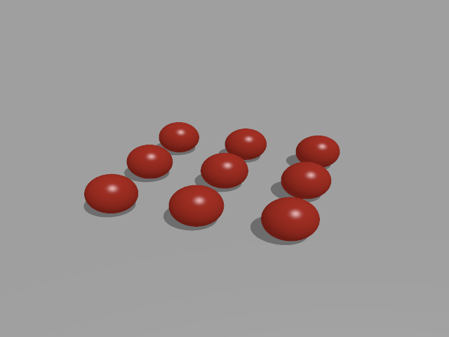
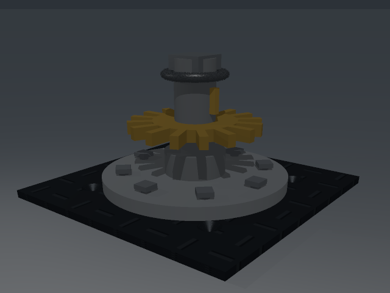
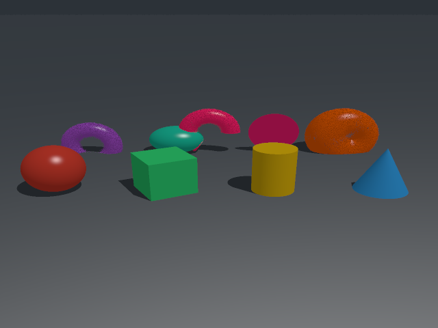
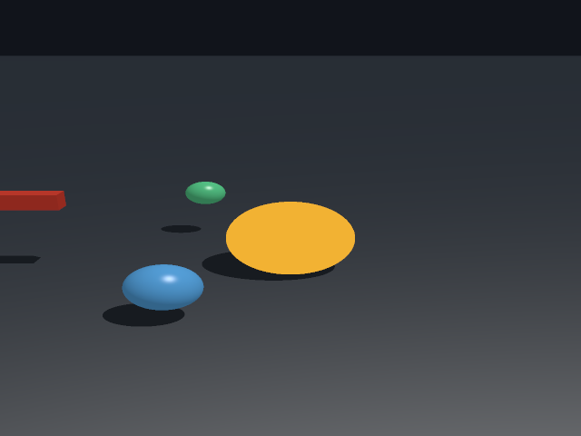

<!-- markdownlint-disable MD033 -->
<!-- markdownlint-configure-file {"MD013": false} -->
# cga — Conformal Geometric Algebra (CGA)

cga is a 5D conformal geometric algebra engine. Pure Rust implementation. It has three parts:

- Algebra core: runs on CPU, float64 precision, 32-component multivector.
- Render engine: runs on GPU (MLX/Metal, via `mlx-rs`). API naming follows three.js.
- Scene authoring: `.jsx` + `.css` files (React style).

cga embeds Euclidean 3D into conformal space (basis `{e1, e2, e3, e0, e∞}`). Points, lines, planes, circles, spheres, and rigid-body motions (motors) are elements of one algebra. Each scene object is a blade. A camera pose is one versor conjugation. Rendering is batched ray–blade intersection on the GPU.

<p align="center"></p>
<p align="center"><sub><code>demo_engine</code> orbit animation: ground, red sphere, blue sphere, gold cylinder, green box, purple disk, refractive glass sphere. Directional + point + ambient light. Hard shadows. aa=2 supersampling.</sub></p>

## Render gallery

Eight gallery scenes (`examples/jsx/*.jsx` + `.css`). One `render_jsx` command produces each image (`animation.jsx` with `render_frames`, see below):

<table>
  <tr>
    <td align="center" width="50%">
      <br>
      <sub><b>orbit.jsx</b> — refractive glass sphere + reflective/diffuse multi-material. Golden-test scene.</sub>
    </td>
    <td align="center" width="50%">
      <br>
      <sub><b>grid.jsx</b> — 3×3 sphere grid with <code>module</code> + <code>for</code>.</sub>
    </td>
  </tr>
  <tr>
    <td align="center" width="50%">
      <br>
      <sub><b>building.jsx</b> — CSG cuts true window holes. <code>map=</code> applies the brick texture.</sub>
    </td>
    <td align="center" width="50%">
      <br>
      <sub><b>mechanical.jsx</b> — bolt-circle drilling pattern. Countersunk cone holes. Torus washer. Gear tooth array.</sub>
    </td>
  </tr>
  <tr>
    <td align="center" width="50%">
      <br>
      <sub><b>primitives.jsx</b> — primitive family: sphere·box·cylinder·cone (blades) + torus·tube·ellipsoid·cyclide·circle (ray inverse transform).</sub>
    </td>
    <td align="center" width="50%">
      <br>
      <sub><b>affine.jsx</b> — non-uniform <code>scale</code>. <code>mirror</code> mirror pair: the off-center hole and corner marker sphere flip with the body.</sub>
    </td>
  </tr>
  <tr>
    <td align="center" width="50%">
      <br>
      <sub><b>assembly.jsx</b> — associative assembly: <code>solve</code> derives hole offsets, <code>&lt;drill through={plate}&gt;</code> cuts through it, <code>face()</code> mounts the posts, <code>&lt;when count={2}&gt;</code> gates the top beam.</sub>
    </td>
    <td align="center" width="50%">
      <br>
      <sub><b>animation.jsx</b> — one module, many frames: the host pushes <code>IN.t</code> each frame, React rebuilds only the consumers (0 instances created after mount), hooks keep state across frames (<code>useEffect</code> counts them).</sub>
    </td>
  </tr>
</table>

## Kinematics

<br>
<sub><code>demo_kinematics</code> — gear pair (16:8 → −1:2). Crank–slider. Helical path <code>M(s)=M₀·exp(s·log(M₀⁻¹M₁))</code>. All written directly with motors.</sub>

## Architecture


- cga models with **blades, not triangle meshes**. Spheres and cylinders have no subdivision count. A dimension is a construction parameter. Each frame, the Rust layer loops over about ten primitives. All per-pixel computation runs in one batch on the GPU.
- The algebra core is always CPU float64. Conformal cancellation far from the origin is not limited by float32. `mlx-rs` is used only for the per-pixel kernels (`renderer` / `geometry_ops` / `shading`). The scalar helpers `s_add`/`s_mul`/… come from `mlxops`.

## Requirements

- Rust stable 1.8x or later.
- macOS, Apple Silicon.

Note: the first build compiles the MLX C++ core once. Later builds use the cache.

## Quick start

1. Run the tests:

   ```bash
   make test
   ```

   Result: all 220 tests pass.

2. Render the smoke scene:

   ```bash
   make run
   ```

   Result: writes `render_smoke.png`.

3. Format the code:

   ```bash
   make fmt
   ```

## Feature summary

| Layer | Content |
| --- | --- |
| **CGA core** | 32-component multivector (plain `[f64; 32]`). Motor versor transforms (gp/reverse/log/velocity). exp/log/interpolation. Two incidence predicates: direct form `op`, dual form `ip`. |
| **Render engine** | three.js naming: Scene / PerspectiveCamera / Object / Sphere·Plane·Cylinder·Box·Circle Geometry / Standard Material / Ambient·Directional·Point Light / Renderer.render / OrbitControls. Object = blade. Transform = motor conjugation. `Renderer::new(w, h, aa, n)` supersampling. |
| **Complex modeling** | **CSG**: recursive true booleans (crossings/contains solid protocol). **Affine extension**: scale/mirror ray inverse transform + Newton polar decomposition. **New primitives**: cone/torus (`arc<2π` gives a tube arc-pipe)/ellipsoid/cyclide. No triangle meshes as scene representation: every solid is an analytic primitive or a CSG of them. Triangles appear only on export (STL / URDF mesh links). |
| **MLX GPU** | Per-pixel vectorized analytic intersection. One kernel batch per full-resolution frame (mlx-rs / Metal). Camera space: X right, Y down, Z forward. |
| **Collision detection** | Analytic narrow phase on the same primitives: three-valued `Hit` (Yes/No/Unknown — CSG difference/intersection never pretend), point containment under any affine transform, exact separation distances for convex pairs (sphere/plane/box/cylinder/cone/torus/ellipsoid, SAT + closest-feature for OBBs). Plan: `docs/collision-plan.md`. |
| **JSX+CSS host** | React-style authoring: `.jsx` scenes (boa executes real JS; swc compiles JSX) + `.css` material sheets (lightningcss). Lands on the same `SceneRun`. Frame-to-frame increments: versioned instances, subtree reuse at build time, pixel-level incremental rendering (bit-identical to full frames). See `docs/jsx-css-host.md`; the CSS conformance plan and its outcome are in `docs/css-conformance.md`. |

## Scene authoring: JSX + CSS (React style)

Scenes are `.jsx` files with a `.css` material sheet. Real JavaScript runs (function components, `map`, ternaries, `Math`); JSX elements map to scene elements; CSS applies materials with **real selector matching** (`.class`, `#id`, `[attr]`, `*`, tag, `:root`, and the `>`/`+`/`~`/descendant combinators), **explicit cascade** (specificity → source order, with `!important` above inline props), **inheritance** from ancestors for material keys and `--*` variables, and `var()` substitution. Unsupported constructs (interactive pseudo-classes, pseudo-elements, `@`-rules, CSS nesting, `calc()`, values with units) **error with the original text** instead of silently degrading; unknown property names stay silently ignored, as in a browser. See `docs/jsx-css-host.md` for the mapping table and boundaries, and `docs/css-conformance.md` for the full conformance record.

Scene example (`examples/jsx/orbit.jsx`):

```jsx
import './orbit.css';

export default (
  <scene>
    <camera fov={50} position={[0, 2.4, 6.2]} target={[0, 0.8, 0]} />
    <plane n={[0, 1, 0]} d={0} class="ground" />
    <translate t={[0, 1, 0]}>
      <sphere r={1} class="red" />
    </translate>
    <directional_light direction={[0.4, 1.0, 0.35]} intensity={0.38} />
  </scene>
);
```

```css
/* orbit.css */
:root { background: #87CEEB; }
.ground { color: #B0B0B0; roughness: 0.7; }
.red { color: #C0392B; roughness: 0.25; metalness: 0.25; }
```

Render a scene file:

```bash
cargo run --release -p cga-examples --bin render_jsx -- examples/jsx/orbit.jsx orbit.png 640 480 2
```

Rules:

- Measured ray-tracing cost model (pure analytic, `bench_ray`): cost ≈ `objects × rays × (1 + lights)` plus CSG child count and refraction recursion. At 640×480 aa=1 with 2 lights: 1 object 15 ms, 100 objects 205 ms, 500 objects 1.0 s, 1000 objects 2.1 s (≈2 ms/object); a light's shadow pass adds ≈0.85 ms per object-light; torus/cyclide cost ≈4× sphere/box (per-ray quartic solves); a glass sphere (Whitted recursion) 56 ms vs 8 ms opaque, but the recursion itself is now subset to the pixels that need it (a partially glass-covered frame no longer pays full-frame reflection/refraction). Per-object screen-space culling keeps off-screen objects cheap (500 mostly off-screen 0.70 s vs 1.04 s visible); `CGA_NO_CULL=1` renders in reference mode.
- CSG evaluates by collecting child crossings, sorting, and testing membership at interval samples — cost `rays × children × samples`, so children are now culled the same way objects are: each child's crossings and membership are evaluated only on the rays that can reach its bounding sphere (per-child ray subsets, conservative). `box − N spheres` at 640×480 aa=1: 16 ms (N=1), 25 ms (4), 83 ms (16), 460 ms (64) — previously 16/32/220/2775 ms. Membership for a convex child (sphere/box/cylinder/cone/ellipsoid, optionally affine-wrapped) is decided from that child's own two crossings (`t_lo ≤ s ≤ t_hi`) instead of evaluating the analytic predicate at every interval sample — bit-identical for clean crossings, with the certified predicate kept for tangencies and non-convex children (torus/cyclide/nested CSG). `CGA_CSG_TIME=1` prints the stage split (crossings / sort+samples / membership / total).
- Current scenes at 640×480 aa=2, CLI end-to-end incl. JSX build + PNG: grid 179 ms, affine 191 ms, assembly 239 ms, primitives 264 ms, orbit 434 ms, building 1.46 s, mechanical 2.43 s. Against the one-shot evaluator that preceded the React runtime, the same scenes render **bit-identically** (verified across two binaries) at +80…+240 ms per process: the runtime parse (≈90 ms) plus module evaluation, React mount and snapshot. The ray-tracing cost model below is unchanged. `building` is CSG + object bound (114 objects), `mechanical` is CSG bound (two `<difference>` nodes; the remaining cost is element-wise work on the dense ray×interval sample grid — sample compaction is the open lever).
- Two ray-tracing modes (`RenderMode`): **Normal** (material `opacity` drives Whitted reflection/refraction; transparent occluders shadow pro-rata) and **IgnoreOpacity** (everything opaque: no secondary rays, transparent occluders shadow like solid ones). Selected per render: `RenderMode::{Normal, IgnoreOpacity}` on `Renderer`, `render_jsx_png_mode(...)` in the host, and `render_jsx --opaque` on the CLI. It is a strict no-op for scenes without transparency (bitwise-identical output) — verified by test; for `orbit.jsx` (glass) the two modes differ and the opaque mode is faster (330 → 160 ms at 640×480 aa=2).
- Interop is **export only**: `export_stl <scene.jsx> [out.stl] [step] [--ascii]` and `export_urdf <scene.jsx> [out.urdf] [--name R] [step]` (the latter also writes `meshes/*.stl`). Solids are tessellated on demand by `GeometryParams::bake` (certified marching tetrahedra); unbounded geometry (planes, infinite cylinders) and circles are skipped and reported.
- Elements: primitives `sphere/plane/cylinder/box/circle/cone/torus/cyclide/ellipsoid`, modifiers `translate/rotate/scale/mirror/material`, CSG `union/difference/intersection`, lights, `camera`, `background`, `joint/gear/cam`, `tag/drill/instances/when`. Kinematic pairs also have **component** forms (`<Revolute>`/`<Prismatic>`/… for joint types, `<Gear>`/`<Cam>` for higher pairs) that expand to the same nodes — the algebra and solving stay in Rust.
- `export default <element>` is the scene. Components are **real React components**: hooks (`useState useReducer useMemo useRef useContext useEffect`), `memo`, fragments and keys all work, and React reconciles — a child's own `setState` creates 0 instances and updates exactly 1, a keyed insert creates 1 and leaves every other instance's identity untouched (both asserted by tests). Control flow is real JS (`map`, ternaries).
- One pass per render: mount → `drain` (deterministic scheduler, no event loop) → snapshot of the committed instance tree. A long-lived `SceneSession` drives many frames instead: it pushes **host input** through React context (`useContext(HostInput)` — only consumers re-render) and can **dispatch events** to a hit instance (custom renderers do not dispatch events themselves, so the host picks the target). `render_frames` is the CLI for it. Interactivity still needs a viewport to produce the events; the mechanism does not.
- CSS matches tag / `.class` / `#id` / `:root` / `scene`. Material keys: `color roughness metalness emissive opacity ior absorption map unlit`. Material inherits down the tree; inline props beat CSS rules; CSS cascades in source order.
- `torus(R, r, arc=2π)`: with `arc<2π` it is a partial arc-pipe (tube).
- Constraint solving: `const [x] = solve([x0], [v => eq(…), v => le(…)])` — numeric residuals with `eq/le/ge` helpers; non-convergence is an explicit error.
- Pose overrides: `run_jsx_pose(jsx, css, root, overrides)` / `report_jsx --set name=value`. Variables read `P.name`; 1-DOF joints match by name with `q` omitted.

### Embedded React runtime

The JSX host runs **real React 19** — not an imitation. `react@19.3.0` + `react-reconciler@0.34.0` + `scheduler@0.28.0` are vendored as one bundled asset and driven by our own renderer adapter, so components get the actual React programming model: hooks, context, `memo`, effects with cleanup, reconciliation and *partial* updates (only the instances that changed are rebuilt — measured in tests: a child's own `setState` creates 0 instances and updates exactly 1).

The runtime loads three assets, in this fixed order, into a single `boa` context; two more are injected ahead of each scene module:

| asset | role |
| --- | --- |
| `assets/react-shim.js` | platform layer: deterministic `setTimeout` / microtask / `performance` / `console` |
| `assets/react-runtime.{dev,prod}.js` | vendored React (generated by `scripts/vendor-react.mjs`) |
| `assets/react-host.js` | renderer adapter: host config → scene instance tree, `{t,p,c}` snapshot |
| `assets/scene-prelude.js` | scene vocabulary injected ahead of each module (element names, `face`/`solve` helpers, `h`) |
| `assets/kinematics-pairs.js` | kinematic-pair React components (`Revolute`/`Prismatic`/`Gear`/`Cam`…) expanding to `<joint>`/`<gear>`/`<cam>` |

Determinism: time is never read from a real clock. `ReactSession::drain` advances a monotonic counter and runs microtasks + timers to a fixed point (bounded; non-convergence is an error), so "mount → commit → effects" completes before the snapshot with no event loop. The renderer adapter is pinned to the React version (React 19 removed `prepareUpdate` and changed `commitUpdate`'s signature); moving to a new React version means updating that adapter.

The JSX host is built on this runtime: `run_jsx` mounts the compiled scene as a React root, drains, and snapshots the committed instance tree — the same `{t,p,c}` shape the scene builder always consumed, so CSS matching, material inheritance and `{__q}` query resolution were untouched. Sessions are pooled per thread, so the runtime is parsed once per process rather than once per render.

The Rust↔JS bridge is deliberately narrow: one command encoder (`HostCall`), one JS entry (`__sess.call`), a structured envelope for every result (`{ok,value}` / `{ok,kind,message,stack}` with `kind` ∈ syntax/runtime/internal), and a **frame transaction** that mounts / updates / dispatches, drains and snapshots in a single cross-thread hop. The `{t,p,c}` snapshot carries a schema version asserted when the session is created, so the two sides cannot drift silently; schema v2 adds per-node commit versions (`__v`/`__s`), which drive frame-to-frame increments: unchanged subtrees are reused field-for-field at scene-build time, and `IncrementalRenderer` re-traces only the rays whose value can change (bit-identical to a full render — see `docs/jsx-css-host.md` §6). Pooled sessions and long-lived interactive sessions are distinct types (`ReactSession<Pooled>` vs `<Owned>`). `CGA_SANDBOX=1` freezes host globals and clears author-added globals after each frame — defense in depth, not a hard sandbox. See `docs/jsx-css-host.md` §8.

Rebuild the vendored bundles with `make vendor-react` (pinned versions, esbuild). `CGA_REACT_DEV=1` selects the dev build (854 KB, invalid-hook-call diagnostics) instead of the production build (273 KB).

Note: the engine's JS parser is recursive, so a *debug* build needs a bigger thread stack for the 854 KB dev bundle (the tests run their session on a 64 MB stack); release builds are fine on the default.

### Errors

- JSX syntax errors come from swc with line numbers: `JSX line N: …`.
- Semantic errors reuse the builder texts: `JSX: unknown primitive frob`, `JSX: joint j q=2.0 outside limit [-1.0, 1.0]`, `JSX: solve did not converge`, …
- Engine errors surface as `JSX eval: …`.

### Capability matrix

| Phase | Capability | Semantics |
| --- | --- | --- |
| **Values** | Geometry values and stable references | `const g = <Box s={…} />; {g}` — elements are values. `<Tag name>` registers named instances. Queries: `center/lo/hi/size/xdir/ydir/zdir` (lazy, resolved at build). |
| **Values** | Derived following | `<Drill r={…} through={…} axis={…} />` is a through-cutting tool. The axial range takes the target bounding box. The hole follows automatically when thickness changes. `from/to` accept a number or a `"name:key"` face reference. |
| **Values** | Face references | `face(x, "+z")` is a face center. `fnrm(x, "+z")` is a normal. Exact for box/cylinder/cone/sphere/ellipsoid. Used for assembly and URDF mount points. `x` is an element or a tag name. |
| **Solve** | Compile-time constraint solving | `const [x] = solve([x0], [v => eq(…), v => le(…)])`. Levenberg-damped Gauss–Newton over numeric residuals. Solved at build time. Non-convergence = build error. |
| **Sets** | Set selection | `<Instances of="hole"/>` re-emits all tagged instances. `<When of="post" count={2}>` gates children on the instance count. |
| **Joints P1** | Kinematic pair declarations | `<Joint name type axis at rpy q limit>` — 8 types: revolute/continuous/prismatic/helical/cylindrical/spherical/planar/fixed. Children pose as `ctx·T(at)·R(rpy)·M(q)` with motors. Nested joints form the parent tree. Report emits one `joint` line per joint. |
| **Joints P2** | Gear coupling | `<Gear driver driven ratio offset />` ≡ URDF `mimic` + ratio: `q_driven = ratio·q_driver + offset`. Driver first, driven later with q omitted (document order). 1-DOF joints only. |
| **Joints P3** | Cam contact solving | `<Cam driver driven driverProfile={…} drivenProfile={…} />` solves the driven q so the profiles touch without penetration. Profiles: `{kind:"circle",c,n,r}` / `{kind:"plane",n,d}`, planar mechanisms only. No contact or multiple contacts are explicit errors. |
| **Pose P4** | Pose overrides | `run_jsx_pose(jsx, css, root, overrides)` / `report_jsx --set name=value`: variables read `P.name`; joint overrides drive 1-DOF joints with q omitted. gear/cam chains re-derive. Report emits `pose name=value` lines. |
| **URDF P5** | URDF export | `jsx_to_urdf` (urdf-rs). origin xyz/rpy ↔ `at`/`rpy` 1:1. gear ↔ `mimic`. helical/cylindrical/spherical decompose into 1-DOF series joints. Non-primitive link geometry (CSG) is tessellated to `meshes/<link>_<slot>.stl` and referenced as `<mesh>`. **Export only — no import.** `floating` is rejected explicitly. |
| **React** | Real React component model | `react@19.3.0` + `react-reconciler` vendored and driven by our renderer adapter: hooks (`useState useReducer useMemo useRef useContext useEffect`), `context`, `memo`, `Fragment`, `key` reconciliation, error boundaries, effect ordering with cleanup. Only changed instances are rebuilt (a child's own `setState` creates 0 / updates 1). |
| **Frames** | Host-driven frames and events | `SceneSession`: input through React context (`useContext(HostInput)`) — only consumers re-render; `dispatch(instance_id, prop, payload)` drives handlers (custom renderers do not dispatch events; the host picks the target). `render_frames` CLI renders a sequence (`animation.jsx`: create=0/update=8 per frame after mount). |
| **Report** | Execution result text | `run.scene.report(…)` / `report_jsx` CLI: scene-level background/camera/light lines + one `object <i> …` line per object + `bounds` + geometry parameter tree + tag registry + joint/gear/cam lines + `summary`. Numbers normalized to six digits. |

The gallery scene `assembly.jsx` (`examples/jsx/assembly.jsx`) exercises every v2/v3 feature together: `solve` derives the hole offsets → `<drill through={plate}>` cuts through the plate (a value used as a prop and as a child) → `face(plate, '+y')` mounts the posts → `<when count={2}>` erects the top beam.

## CGA modeling vs traditional Euclidean modeling

| Dimension | Traditional Euclidean modeling (three.js/mesh) | CGA modeling in this project |
| --- | --- | --- |
| **Geometry representation** | Triangle meshes. Spheres/cylinders are approximated by subdivision. | Implicit blade analytic equations. Exact. No subdivision. |
| **Dimension/precision** | Subdivision count determines precision. Facets visible up close. | Dimension = construction parameter. Consistent rendering at any distance. |
| **Transform mechanism** | Chained 4×4 matrix products. Floating-point error breaks orthogonality. | `X' = M·X·M̃`. Any product of motors is a motor. Inverse = reverse. |
| **Camera** | Separate view/projection matrices. | The camera pose is also a motor. |
| **Render pipeline** | Rasterization: vertex shading → interpolation → z-buffer. | Ray tracing: analytic ray–blade intersection per pixel. |
| **Unity** | Three mechanisms: geometry, transforms, rendering. | Points, lines, planes, circles, spheres, and rigid motions live in one 5D algebra. |
| **Animation** | Matrices have no interpolation semantics. Decomposition + quaternions required. | `Motor.exp/log` interpolates directly. The velocity bivector can be extracted directly. |

**Three direct consequences:**

| <br>① No polygons | <br>② Infinite geometry | <br>③ Transform isomorphism |
| --- | --- | --- |
| Spheres/cylinders have no polygons. Render quality does not degrade with camera distance. | Infinite planes and infinite cylinders are properties of the algebraic objects themselves. No clipping needed (the cylinder in figure b reaches the horizon). | Motors and blades are the same kind of object. There is no matrix–quaternion–axis-angle conversion layer. |

## Complex modeling capabilities

**True CSG booleans** — `difference()` / `intersection()` compose recursively and nest arbitrarily. The kernel collects all boundary crossings of the subtree, tests membership interval by interval, and takes the nearest solid surface. Leaves = all solid primitives + the `plane` half-space. Half-space intersection = section view.


**New primitives** — cone (convex-body interval clipping) / torus (Durand–Kerner solves the quartic; `arc<2π` gives a partial arc-pipe tube; JSX and the Rust API share one source) / ellipsoid (affinely scaled sphere) / cyclide (Dupin cyclide quartic surface). These four are not CGA blades. They connect through ray inverse transforms. See the gallery image `primitives.jsx`.

**Affine extension** — scale/mirror connect through the AffineGeometry ray inverse transform. Versors cannot express these two transform classes. Normals use the inverse-transpose transform. Mirrors are automatically correct when det<0. The context is a full 4×4 affine. Geometry landing points are decomposed into motor·linear by Newton polar decomposition. Any nesting order of `rotate` with `scale/mirror` is correct. See the mirror pair in the gallery `affine.jsx`.

## Generation / headless rendering

This is the library-level entry for programmatic callers (LLM codegen, external GUIs). `demo_lang` runs three things in one pass: generation → headless render → scene report. Generated JSX uses the same PascalCase element vocabulary as the scene host (`<Scene>` / `<Camera>` / `<Difference>` / `<Rotate>` …), so it reads like hand-written scenes. Besides the decorative flange, `gen_pairs_showcase()` emits every kinematic pair — the 8 joint types plus the `<Gear>` and `<Cam>` higher pairs — and `demo_pairs` writes it out.


```rust
// Generation: structured parameters → flat JSX source (deterministic, diffable, parseable by construction)
let text = cga_gpu::gen_flange_assembly(
    &FlangeSpec::default(), &BoltCircleSpec::default(),
    &GearSpec::default(), &BasePlateSpec::default());

// Headless rendering: JSX scene → PNG bytes. No window, no CLI.
let out = cga_gpu::render_jsx_png(&text, None, ".", 640, 480, 2)?;
std::fs::write("preview.png", out.png)?;

// Scene report: deterministic line-by-line text of the execution result. An LLM verifier can assert it directly.
let report = cga_gpu::run_jsx(&text, None, ".")
    .map(|r| r.scene.report(&r.camera, &r.tags, &r.kinematics))?;
```

Excerpt from `examples/lang/report.txt` (a `demo_lang` artifact). One geometry parameter tree per object + bounding box. Numbers normalized to six digits:

```text
scene version=1
camera(fov=45, aspect=1.777778, position=[7.5,6.5,9.5], target=[0,1.8,0], ...);
object 1 material(...) difference(frame(t=[0,0.55,0], axis=[-1,0,0], angle=1.570796, cylinder(r=2.6, h=0.5)), ...);
bounds 1 lo=[-2.6,-2.3,-2.6] hi=[2.6,3.4,2.6]
...
summary objects=41 lights=3 no_bounds=1 bbox_lo=[-3.5,-2.3,-3.5] bbox_hi=[3.5,5.55,3.5]
```

## Scene code

```rust
use cga_core::*;
use cga_gpu::*;

let mut scene = Scene::new(None);
scene.add_object(Object::new(ObjectParams {
    geometry: Geometry::PlaneGeometry(PlaneGeometry::new([0.0, 1.0, 0.0], 0.0)),
    material: Material::standard(MaterialParams {
        color: Color::from_hex(0xB0B0B0), roughness: 0.7, metalness: 0.0,
        emissive: Color::from_hex(0x000000), opacity: 1.0, ior: 1.5, absorption: 0.0,
    }),
    position: [0.0, 0.0, 0.0], rotation_axis: [0.0, 0.0, 1.0],
    rotation_angle: 0.0, motor: None,
}));                                          // ground: dual plane blade (y=0)
scene.add_object(Object::new(ObjectParams {
    geometry: Geometry::SphereGeometry(SphereGeometry::new(1.0)),
    material: Material::standard(MaterialParams {
        color: Color::from_hex(0xC0392B), roughness: 0.25, metalness: 0.25,
        emissive: Color::from_hex(0x000000), opacity: 1.0, ior: 1.5, absorption: 0.0,
    }),
    position: [0.0, 1.0, 0.0], rotation_axis: [0.0, 0.0, 1.0],
    rotation_angle: 0.0, motor: None,
}));                                          // sphere: dual sphere blade. Radius is the dimension.
scene.add_light(Light::directional(Color::from_hex(0xFFFFFF), 0.38, [0.4, 1.0, 0.35]));
scene.add_light(Light::ambient(Color::from_hex(0xFFFFFF), 0.34));

let mut camera = PerspectiveCamera::new(50.0, 4.0 / 3.0, 0.1, 100.0,
    [0.0, 2.4, 6.2], [0.0, 0.8, 0.0], [0.0, 1.0, 0.0]);
camera.look_at([0.0, 0.8, 0.0], None);

let mut renderer = Renderer::new(360, 270, 2, 3);
let img = renderer.render(scene, camera);       // (H, W, 4) uint8 RGBA
save_frame_png("out.png", &img);
```

See signatures in `crates/cga-gpu/src/scene.rs` / `renderer.rs` / `shading.rs`.

## Stereo rendering

`stereo_pair` renders strictly rectified left/right images with two cameras. The two cameras have identical orientation and differ only by a baseline. It also outputs geometric ground truth:

<table>
  <tr>
    <td align="center" width="50%"><br><sub>Left image <code>left.png</code></sub></td>
    <td align="center" width="50%"><br><sub>Right image <code>right.png</code>. Baseline shift along x only.</sub></td>
  </tr>
</table>

It also outputs `truth.txt`: focal length, baseline, per-object depth and disparity. The camera-space convention matches r3d's `Depth` (left image first; rectified disparity is x-only). `stereo` / `depth` can read these directly.

```bash
cargo run --release -p cga-examples --bin stereo_pair -- 7 examples/stereo 480 360 0.10
```

## Known limitations (gap vs three.js)

- **Shadows**: one occlusion ray per light (hard shadows). No soft shadows. No post-processing. No tonemap. No envMap/IBL. High-metalness materials render dark. The demos therefore lower metalness.
- **Textures**: `material(map=...)` does analytic UV sampling. No mipmap. No filtering control.
- **scale/mirror**: connected through the AffineGeometry ray inverse transform. Versors cannot express them. Blade semantics (meet/incidence predicates) do not apply to affinely deformed primitives.
- **CSG**: classification uses intervals between crossings (no δ sampling). Tangencies/multiple roots take the discriminant-exact path. Undecidable cases report `Unknown` explicitly; no silent guessing. One material per node. `circle` is not a solid.
- **Non-blade primitives**: cone/torus/ellipsoid/cyclide connect through ray inverse transforms. The ring cyclide is a smooth genus-1 surface. The spindle type self-intersects; CSG membership semantics degrade.
- **Precision**: the algebra core is always CPU float64. The render kernels are float32 (MLX/Metal have no float64). Parameters end up near the origin after entering camera space.

## Potential robotics applications


| Direction | Basis |
| --- | --- |
| Simulation and synthetic data | Ray-traced synthetic depth/RGB. Changing the viewpoint only requires resetting the camera motor. Suited for domain-randomized batch generation (with exact depth ground truth). |
| Kinematics and trajectories | A motor is the versor representation of SE(3). `exp`/`log`/`velocity_bivector`/`interpolate` already exist. `motor = exp(s·log(M₀·M₁⁻¹))` generates smooth rigid-body paths. |
| Geometry-aware output | A primitive blade is the semantic of the manipulated object. A plane normal = the grasp pose z axis. A cylinder axis + radius = the gripper opening. |
| Reconstruction loop verification | Render the reconstructed scene back to the original viewpoint. Depth comparison against the original frame detects drift. |
| Unified coordinate transforms | Camera, robot arm, and workpiece share one algebra. Chained multi-frame transforms converge to one representation. |

## Project layout

```text
crates/
  cga-core/                 pure f64 CPU algebra core
    multivector / tables    32-component MVP + GP product tables (generated by gen_tables.py)
    motors / primitives     motors, primitive incidence predicates and distances
    cyclide / geometry      Dupin cyclide, Geometry and camera parameters
    affine / affine_geom    affine extension (scale/mirror inverse transform + Newton polar decomposition)
    csg_node / geometry     CSG tree, geometry params (+ identity_params), mat4 helpers
    stl / gif               STL encoding (export), GIF89a encoding
  cga-gpu/                  mlx-rs/Metal GPU kernels
    mlxops / shading        scalar broadcast helpers, material lights and batched Blinn-Phong
    scene / scene_graph     Object·Scene·PerspectiveCamera·OrbitControls, Vec3/Color
    geometry_ops / geometry_extra / geom_kernels   blade analytic intersection (incl. cone/torus/ellipsoid/cyclide)
    csg / certify           recursive CSG booleans, certifiable root-finding and interval classification
    texture / image_io / shading  textures, PNG, batched Blinn-Phong
    renderer                mlx-rs GPU batched ray tracing (SSAA/hard shadows/Whitted refraction), per-object frustum culling
  cga-host/                 scene authoring host (no mlx dependency)
    scene_build / scene_report  scene builders, kinematics registry, scene report text
    jsx                     JSX+CSS scene host (swc compile → boa execute → SceneRun)
    jsx_gen                 structured-parameter → flat-JSX generators
    export / urdf           STL export (bake → binary/ASCII) + URDF export (mesh links, export only)
  cga-examples/             demo CLIs (src/bin/*.rs)
examples/                   jsx/ React-style scenes (.jsx+.css) + gallery/ PNGs + gallery/assets textures + demo output images (README figures; lang is the generation-pipeline showcase)
docs/                       architecture diagram, robotics diagram, cross-platform plan, CSS conformance plan, collision plan
```

Demo CLIs (`cargo run --release -p cga-examples --bin <name>`):

| CLI | Output |
| --- | --- |
| `demo_engine [frames]` | `examples/engine/orbit.gif` |
| `demo_advantage` | `examples/advantage/advantage_{a,b,c}.png` three panels |
| `demo_kinematics` | `examples/kinematics/kinematics.gif` |
| `demo_csg` | `examples/csg/demo_csg.png` (union/difference/intersection side by side) |
| `demo_lang` | `examples/lang/{generated_flange.jsx, demo_lang.png, report.txt}` (generate → headless render → report) |
| `demo_pairs` | `examples/pairs/{pairs.jsx, pairs.png, pairs.txt}` — all 8 joint types + gear + cam higher pairs (generate → report → render) |
| `export_stl <file.jsx> [out.stl] [step] [--ascii]` | JSX → STL（实体三角化；平面/无限长圆柱/圆跳过并列出） |
| `export_urdf <file.jsx> [out.urdf] [--name R] [step]` | JSX 关节树 → URDF（+ `meshes/*.stl`） |
| `render_jsx <file.jsx> [out.png] [w h aa] [--opaque]` | JSX(+CSS) → PNG（`--opaque` = 忽略透明度模式） |
| `render_frames <file.jsx> [prefix] [w h aa frames]` | 逐帧：宿主每帧推入 `IN.t`，React 局部重渲染后出图 `<prefix>_NN.png`（并打印每帧协调计数） |
| `report_jsx <file.jsx> [--set name=value]` | JSX → scene report (stdout line-by-line assertable text; errors go to stderr, exit 1) |
| `stereo_pair [seed] [out_dir] [w h] [baseline]` | `left.png` / `right.png` / `truth.txt` stereo pair |

## Quality

- `make test`: **all 220 tests pass** (cga-core 59 + cga-gpu 87 + cga-host 74, no `#[ignore]`). Coverage: algebraic identities, primitive incidence predicates, versor exp-log round trips, anti-aliasing, quantitative engine rendering, CSG, affine, new primitives, cyclide, certified f64 fallback for the f32 crossing guards (sphere/cylinder/cone/ellipsoid discriminants, torus/cyclide quartics, near-parallel planes), scale-relative CSG UV probes, the degenerate-case library + interval classification + certifiable root-finding, baked-mesh watertightness/volume/topology, the JSX+CSS host (gallery smoke, components, control flow, the CSS conformance suite — 31-case selector table, cascade matrix, value conversion, error contract — plus joints/gear, solve, pose, frozen render goldens), **frame-to-frame increments** (instance versions, subtree-reuse ≡ full rebuild field-for-field, incremental rendering bit-identical to full frames, shadow footprints on unbounded planes, transparent cascades, full-frame fallbacks), the embedded React runtime (hooks/context/memo/keys, partial updates, effect ordering, unmount cleanup, determinism, author-error reporting), the two render modes (IgnoreOpacity is a bitwise no-op without transparency; refraction and transparent-occluder shadows differ), the builder layer (geometry/material/validation), joints (P1 six-type poses and nesting, P2 gear coupling, P3 cam contact solving, P1.1 rpy frames, P4 pose overrides), URDF export, STL export (binary/ASCII layout, non-solid skipping, world-space placement), collision detection (pairwise separation matrix with analytic distances, three-valued CSG containment, Unknown-never-pretends pairs, conservative AABB fallback, separation symmetry), scene reports.
- Render goldens are written to `artifacts/tests/` (gitignored). The sphere/cone/ellipsoid/cyclide/torus/textured_box/csg goldens have **RMSE = 0**.

## License

MIT. See [LICENSE](LICENSE).
