<!-- markdownlint-disable MD033 -->
<!-- markdownlint-configure-file {"MD013": false} -->
# cga — Conformal Geometric Algebra (CGA)

cga is a 5D conformal geometric algebra engine. Pure Rust implementation. It has three parts:

- Algebra core: runs on CPU, float64 precision, 32-component multivector.
- Render engine: runs on GPU (MLX/Metal, via `mlx-rs`). API naming follows three.js.
- Scene authoring: `.jsx` + `.css` files (React style).

cga embeds Euclidean 3D into conformal space (basis `{e1, e2, e3, e0, e∞}`). Points, lines, planes, circles, spheres, and rigid-body motions (motors) are elements of one algebra. Each scene object is a blade. A camera pose is one versor conjugation. Rendering is batched ray–blade intersection on the GPU.

<p align="center">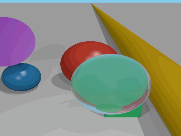</p>
<p align="center"><sub><code>demo_engine</code> orbit animation: ground, red sphere, blue sphere, gold cylinder, green box, purple disk, refractive glass sphere. Directional + point + ambient light. Hard shadows. aa=2 supersampling.</sub></p>

## Render gallery

Eight gallery scenes (`examples/jsx/*.jsx` + `.css`). One `render_jsx` command produces each image:

<table>
  <tr>
    <td align="center" width="50%">
      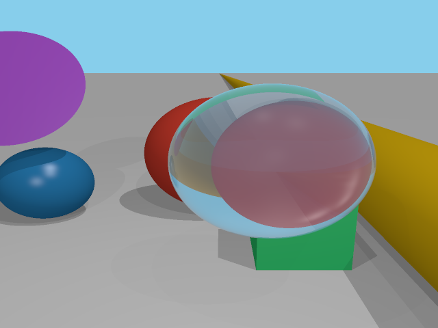<br>
      <sub><b>orbit.jsx</b> — refractive glass sphere + reflective/diffuse multi-material. Golden-test scene.</sub>
    </td>
    <td align="center" width="50%">
      <br>
      <sub><b>grid.jsx</b> — 3×3 sphere grid with <code>module</code> + <code>for</code>.</sub>
    </td>
  </tr>
  <tr>
    <td align="center" width="50%">
      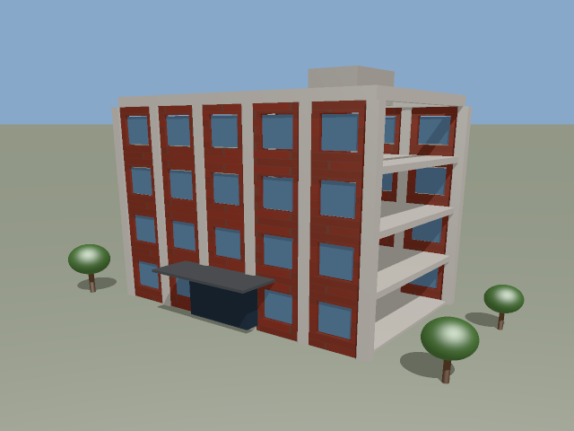<br>
      <sub><b>building.jsx</b> — CSG cuts true window holes. <code>map=</code> applies the brick texture.</sub>
    </td>
    <td align="center" width="50%">
      <br>
      <sub><b>mechanical.jsx</b> — bolt-circle drilling pattern. Countersunk cone holes. Torus washer. Gear tooth array.</sub>
    </td>
  </tr>
  <tr>
    <td align="center" width="50%">
      <br>
      <sub><b>primitives.jsx</b> — primitive family: sphere·box·cylinder·cone (blades) + torus·tube·ellipsoid·cyclide·circle (ray inverse transform).</sub>
    </td>
    <td align="center" width="50%">
      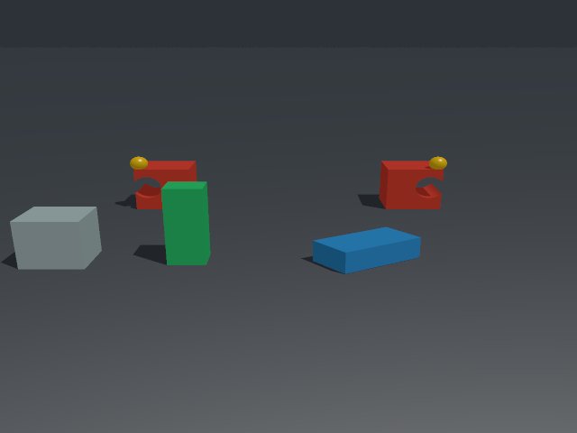<br>
      <sub><b>affine.jsx</b> — non-uniform <code>scale</code>. <code>mirror</code> mirror pair: the off-center hole and corner marker sphere flip with the body.</sub>
    </td>
  </tr>
  <tr>
    <td align="center" width="50%">
      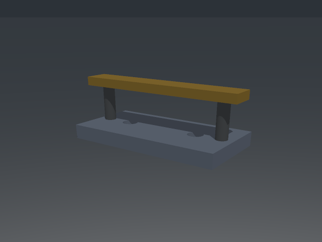<br>
      <sub><b>assembly.jsx</b> — v2/v3 showcase: <code>constrain</code> solves hole positions. <code>drill</code> cuts through. <code>face</code> mounts posts. <code>instances</code> gates the top beam. Method chaining throughout.</sub>
    </td>
    <td align="center" width="50%">
      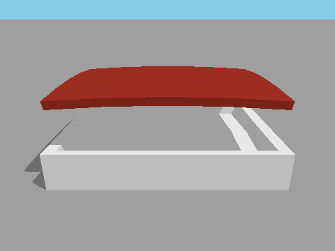<br>
      <sub><b>freeform.jsx</b> — bicubic Bézier surface shell. Slot cut into a thick-shell surface (CSG leaf).</sub>
    </td>
  </tr>
</table>

| Interop | Kinematics |
| --- | --- |
| 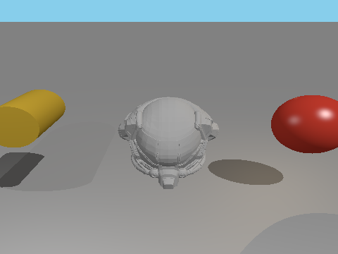<br><sub>Load glTF <code>DamagedHelmet.glb</code> and render.</sub><br>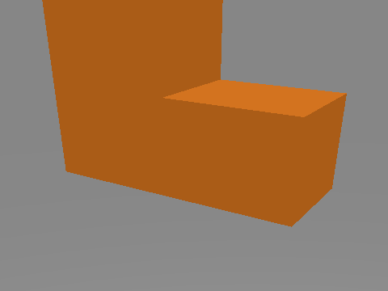<br><sub>Extrude L-shape → write <code>.glb</code> → read back → render.</sub> | 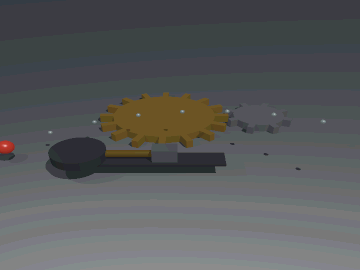<br><sub><code>demo_kinematics</code> — gear pair (16:8 → −1:2). Crank–slider. Helical path <code>M(s)=M₀·exp(s·log(M₀⁻¹M₁))</code>. All written directly with motors.</sub> |

## Architecture

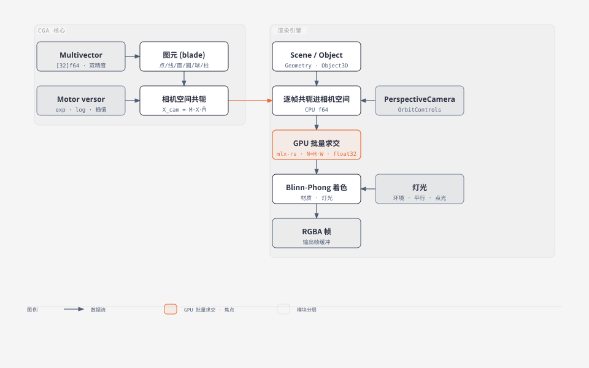

- cga models with **blades, not triangle meshes**. Spheres and cylinders have no subdivision count. A dimension is a construction parameter. Each frame, the Rust layer loops over about ten primitives. All per-pixel computation runs in one batch on the GPU.
- The algebra core is always CPU float64. Conformal cancellation far from the origin is not limited by float32. `mlx-rs` is used only for the per-pixel kernels (`renderer` / `geometry_ops` / `shading`). The scalar helpers `s_add`/`s_mul`/… come from `mlxops`.

## Requirements

- Rust stable 1.8x or later.
- macOS, Apple Silicon.

Note: the first build compiles the MLX C++ core once. Later builds use the cache.

## Quick start

1. Run the tests:

   ```bash
   make test
   ```

   Result: all 196 tests pass.

2. Render the smoke scene:

   ```bash
   make run
   ```

   Result: writes `render_smoke.png`.

3. Format the code:

   ```bash
   make fmt
   ```

## Feature summary

| Layer | Content |
| --- | --- |
| **CGA core** | 32-component multivector (plain `[f64; 32]`). Motor versor transforms (gp/reverse/log/velocity). exp/log/interpolation. Two incidence predicates: direct form `op`, dual form `ip`. |
| **Render engine** | three.js naming: Scene / PerspectiveCamera / Mesh / Sphere·Plane·Cylinder·Box·Circle Geometry / MeshStandard Material / Ambient·Directional·Point Light / Renderer.render / OrbitControls. Object = blade. Transform = motor conjugation. `Renderer::new(w, h, aa, n)` supersampling. |
| **Complex modeling** | **CSG**: recursive true booleans (crossings/contains solid protocol). **Affine extension**: scale/mirror ray inverse transform + Newton polar decomposition. **New primitives**: cone/torus (`arc<2π` gives a tube arc-pipe)/ellipsoid/cyclide. **Mesh**: Möller–Trumbore batch intersection + extrude/loft + OBJ/glTF/GLB. |
| **MLX GPU** | Per-pixel vectorized analytic intersection. One kernel batch per full-resolution frame (mlx-rs / Metal). Camera space: X right, Y down, Z forward. |
| **JSX+CSS host** | React-style authoring: `.jsx` scenes (boa executes real JS; swc compiles JSX) + `.css` material sheets (lightningcss). Lands on the same `CgsRun`; orbit.jsx renders byte-identical to orbit.jsx. See `docs/cgs-react-css.md`. |

## Scene authoring: JSX + CSS (React style)

Scenes are `.jsx` files with a `.css` material sheet. Real JavaScript runs (function components, `map`, ternaries, `Math`); JSX elements map to scene elements; CSS rules apply materials by tag/class/id. See `docs/cgs-react-css.md` for the mapping table and boundaries. The retired CGS text syntax is no longer parsed.

Scene example (`examples/jsx/orbit.jsx`):

```jsx
import './orbit.css';

export default (
  <scene>
    <camera fov={50} position={[0, 2.4, 6.2]} target={[0, 0.8, 0]} />
    <plane n={[0, 1, 0]} d={0} class="ground" />
    <translate t={[0, 1, 0]}>
      <sphere r={1} class="red" />
    </translate>
    <directional_light direction={[0.4, 1.0, 0.35]} intensity={0.38} />
  </scene>
);
```

```css
/* orbit.css */
:root { background: #87CEEB; }
.ground { color: #B0B0B0; roughness: 0.7; }
.red { color: #C0392B; roughness: 0.25; metalness: 0.25; }
```

Render a scene file:

```bash
cargo run --release -p cga-examples --bin render_jsx -- examples/jsx/orbit.jsx orbit.png 640 480 2
```

Rules:

- Elements: primitives `sphere/plane/cylinder/box/circle/cone/torus/cyclide/ellipsoid/bezier/extrude/loft/mesh`, modifiers `translate/rotate/scale/mirror/material`, CSG `union/difference/intersection`, lights, `camera`, `background`, `joint/gear/cam`, `tag/drill/instances/when`.
- `export default <element>` is the scene. Function components are plain JS functions. Control flow is real JS (`map`, ternaries).
- CSS matches tag / `.class` / `#id` / `:root` / `scene`. Material keys: `color roughness metalness emissive opacity ior absorption map unlit`. Material inherits down the tree; inline props beat CSS rules; CSS cascades in source order.
- `bezier(points={16 [x,y,z]}, thickness={0}, div={8})`: `thickness=0` is a render surface. `thickness>0` is a watertight thick shell; it can enter CSG and baking.
- `torus(R, r, arc=2π)`: with `arc<2π` it is a partial arc-pipe (tube).
- Constraint solving: `const [x] = solve([x0], [v => eq(…), v => le(…)])` — numeric residuals with `eq/le/ge` helpers; non-convergence is an explicit error.
- Pose overrides: `run_jsx_pose(jsx, css, root, overrides)` / `report_jsx --set name=value`. Variables read `P.name`; 1-DOF joints match by name with `q` omitted.

### Errors

- JSX syntax errors come from swc with line numbers: `JSX line N: …`.
- Semantic errors reuse the builder texts: `JSX: unknown primitive frob`, `JSX: joint j q=2.0 outside limit [-1.0, 1.0]`, `JSX: solve did not converge`, …
- Engine errors surface as `JSX eval: …`.

### Capability matrix

| Phase | Capability | Semantics |
| --- | --- | --- |
| **Values** | Geometry values and stable references | `const g = <Box s={…} />; {g}` — elements are values. `<Tag name>` registers named instances. Queries: `center/lo/hi/size/xdir/ydir/zdir` (lazy, resolved at build). |
| **Values** | Derived following | `<Drill r={…} through={…} axis={…} />` is a through-cutting tool. The axial range takes the target bounding box. The hole follows automatically when thickness changes. `from/to` accept a number or a `"name:key"` face reference. |
| **Values** | Face references | `face(x, "+z")` is a face center. `fnrm(x, "+z")` is a normal. Exact for box/cylinder/cone/sphere/ellipsoid. Used for assembly and URDF mount points. `x` is an element or a tag name. |
| **Solve** | Compile-time constraint solving | `const [x] = solve([x0], [v => eq(…), v => le(…)])`. Levenberg-damped Gauss–Newton over numeric residuals. Solved at build time. Non-convergence = build error. |
| **Sets** | Set selection | `<Instances of="hole"/>` re-emits all tagged instances. `<When of="post" count={2}>` gates children on the instance count. |
| **Joints P1** | Kinematic pair declarations | `<Joint name type axis at rpy q limit>` — 8 types: revolute/continuous/prismatic/helical/cylindrical/spherical/planar/fixed. Children pose as `ctx·T(at)·R(rpy)·M(q)` with motors. Nested joints form the parent tree. Report emits one `joint` line per joint. |
| **Joints P2** | Gear coupling | `<Gear driver driven ratio offset />` ≡ URDF `mimic` + ratio: `q_driven = ratio·q_driver + offset`. Driver first, driven later with q omitted (document order). 1-DOF joints only. |
| **Joints P3** | Cam contact solving | `<Cam driver driven driverProfile={…} drivenProfile={…} />` solves the driven q so the profiles touch without penetration. Profiles: `{kind:"circle",c,n,r}` / `{kind:"plane",n,d}`, planar mechanisms only. No contact or multiple contacts are explicit errors. |
| **Pose P4** | Pose overrides | `run_jsx_pose(jsx, css, root, overrides)` / `report_jsx --set name=value`: variables read `P.name`; joint overrides drive 1-DOF joints with q omitted. gear/cam chains re-derive. Report emits `pose name=value` lines. |
| **URDF P5/P6** | URDF interop | `jsx_to_urdf` / `urdf_to_jsx` (urdf-rs). origin xyz/rpy ↔ `at`/`rpy` 1:1. gear ↔ `mimic`. helical/cylindrical/spherical decompose into 1-DOF series joints. Non-primitive link geometry bakes to watertight OBJ. `floating` is rejected explicitly. |
| **Report** | Execution result text | `run.scene.report(…)` / `report_jsx` CLI: scene-level background/camera/light lines + one `object <i> …` line per object + `bounds` + geometry parameter tree + tag registry + joint/gear/cam lines + `summary`. Numbers normalized to six digits. |

The gallery scene `assembly.jsx` (`examples/jsx/assembly.jsx`) exercises every v2/v3 feature together: `constrain` solves hole positions → `drill` cuts through → `face` face centers mount posts → `instances` counts and erects the top beam.

## CGA modeling vs traditional Euclidean modeling

| Dimension | Traditional Euclidean modeling (three.js/mesh) | CGA modeling in this project |
| --- | --- | --- |
| **Geometry representation** | Triangle meshes. Spheres/cylinders are approximated by subdivision. | Implicit blade analytic equations. Exact. No subdivision. |
| **Dimension/precision** | Subdivision count determines precision. Facets visible up close. | Dimension = construction parameter. Consistent rendering at any distance. |
| **Transform mechanism** | Chained 4×4 matrix products. Floating-point error breaks orthogonality. | `X' = M·X·M̃`. Any product of motors is a motor. Inverse = reverse. |
| **Camera** | Separate view/projection matrices. | The camera pose is also a motor. |
| **Render pipeline** | Rasterization: vertex shading → interpolation → z-buffer. | Ray tracing: analytic ray–blade intersection per pixel. |
| **Unity** | Three mechanisms: geometry, transforms, rendering. | Points, lines, planes, circles, spheres, and rigid motions live in one 5D algebra. |
| **Animation** | Matrices have no interpolation semantics. Decomposition + quaternions required. | `Motor.exp/log` interpolates directly. The velocity bivector can be extracted directly. |

**Three direct consequences:**

| 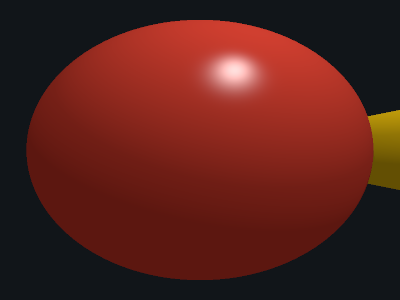<br>① No polygons | 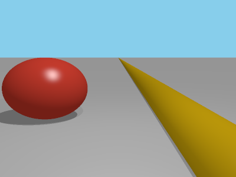<br>② Infinite geometry | 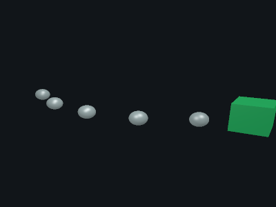<br>③ Transform isomorphism |
| --- | --- | --- |
| Spheres/cylinders have no polygons. Render quality does not degrade with camera distance. | Infinite planes and infinite cylinders are properties of the algebraic objects themselves. No clipping needed (the cylinder in figure b reaches the horizon). | Motors and blades are the same kind of object. There is no matrix–quaternion–axis-angle conversion layer. |

## Complex modeling capabilities

**True CSG booleans** — `difference()` / `intersection()` compose recursively and nest arbitrarily. The kernel collects all boundary crossings of the subtree, tests membership interval by interval, and takes the nearest solid surface. Leaves = all solid primitives + the `plane` half-space. Half-space intersection = section view.

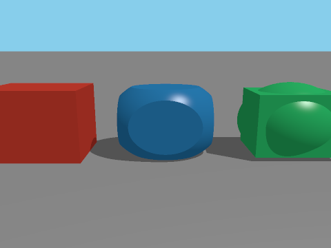

**New primitives** — cone (convex-body interval clipping) / torus (Durand–Kerner solves the quartic; `arc<2π` gives a partial arc-pipe tube; CGS and the Rust API share one source) / ellipsoid (affinely scaled sphere) / cyclide (Dupin cyclide quartic surface). These four are not CGA blades. They connect through ray inverse transforms. See the gallery image `primitives.jsx`.

**Affine extension** — scale/mirror connect through the AffineGeometry ray inverse transform. Versors cannot express these two transform classes. Normals use the inverse-transpose transform. Mirrors are automatically correct when det<0. The context is a full 4×4 affine. Geometry landing points are decomposed into motor·linear by Newton polar decomposition. Any nesting order of `rotate` with `scale/mirror` is correct. See the mirror pair in the gallery `affine.jsx`.

**Mesh and interop** — `MeshGeometry`: Möller–Trumbore batch intersection. Flat normals. No BVH. `modeling.rs`: extrude (ear-clipping triangulation of concave outlines) and loft (equal-point-count multi-section). `mesh_io.rs`: pure-stdlib OBJ read/write. `mesh_io_gltf.rs`: glTF/GLB read/write (node transforms/hierarchy/material colors).

**Freeform surfaces (P3)** — `bezier(points=16, thickness, div)` is a rational bicubic Bézier patch. See the surface shell and the slotted surface in the gallery `freeform.jsx`. Its `crossings`/`contains`/`field`/`bounds` reuse the mesh MT kernel (uniform `div×div` tessellation; the analytic chord-height bound is asserted in tests). With `thickness>0` it stitches a watertight offset thick shell (top/bottom/side walls share indices; every edge asserted ×2) — a true solid that can enter CSG and baking. With `thickness=0` it is a render surface. CSG and baking reject it explicitly (same family as `circle`). Full example: `examples/cgs/freeform.jsx`. Measured constraint: CSG×mesh memory grows as O(rays × intersections × triangles). The interval classifier samples (k+1) points per ray. `contains` evaluates in chunks under a 256 MB temporary budget to prevent OOM. A high `div` must be paired with low resolution/aa.

**Baking** — `bake` turns any CSG implicit solid into a triangle mesh. **Pure CPU float64, no GPU dependency. Runs on Linux/CI.** Pipeline: signed field (same sign convention as the GPU `*_contains`) → marching tetrahedra (Kuhn six-tetrahedron subdivision) → bit-exact vertex welding + component-wise consistent orientation. **Watertightness is a constructive conclusion, not luck.** `topology_report()` puts boundary edges, non-manifold edges, and the Euler characteristic into CI assertions. Non-finite field values report an explicit error: export must not abstain. The image below is the `demo_bake` output. Left: implicit CSG original (analytically smooth). Right: baked mesh (visible facets).

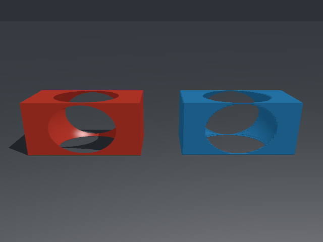

```text
$ cargo run --release -p cga-examples --bin demo_bake
topology: TopologyReport { vertices: 40868, faces: 81744, degenerate_faces: 0,
  boundary_edges: 0, nonmanifold_edges: 0, inconsistent_edges: 0, euler: -4 }
volume: 1.3911
saved examples/bake/demo_bake.png + demo_bake.obj
```

```bash
cargo run --release -p cga-examples --bin bake_jsx -- examples/jsx/mechanical.jsx out.obj 0.1
```

Note: a coarse step loses features finer than the step. Tangent/coplanar degeneracies inherit the CSG sampling semantics. Baked meshes suit simulation collision and preview. Exact STEP export is out of scope.

## Generation / headless rendering

This is the library-level entry for programmatic callers (LLM codegen, external GUIs). `demo_lang` runs three things in one pass: generation → headless render → scene report.

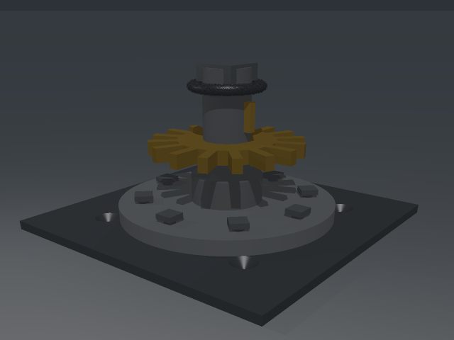

```rust
// Generation: structured parameters → flat JSX source (deterministic, diffable, parseable by construction)
let text = cga_gpu::gen_flange_assembly(
    &FlangeSpec::default(), &BoltCircleSpec::default(),
    &GearSpec::default(), &BasePlateSpec::default());

// Headless rendering: JSX scene → PNG bytes. No window, no CLI.
let out = cga_gpu::render_jsx_png(&text, None, ".", 640, 480, 2)?;
std::fs::write("preview.png", out.png)?;

// Scene report: deterministic line-by-line text of the execution result. An LLM verifier can assert it directly.
let report = cga_gpu::run_jsx(&text, None, ".")
    .map(|r| r.scene.report(&r.camera, &r.tags, &r.kinematics))?;

// Mesh baking: CSG → triangle mesh (pure CPU f64)
let m = world_params.bake(0.1)?;
let v = m.volume();
```

Excerpt from `examples/lang/report.txt` (a `demo_lang` artifact). One geometry parameter tree per object + bounding box. Numbers normalized to six digits:

```text
scene version=1
camera(fov=45, aspect=1.777778, position=[7.5,6.5,9.5], target=[0,1.8,0], ...);
object 1 material(...) difference(frame(t=[0,0.55,0], axis=[-1,0,0], angle=1.570796, cylinder(r=2.6, h=0.5)), ...);
bounds 1 lo=[-2.6,-2.3,-2.6] hi=[2.6,3.4,2.6]
...
summary objects=41 lights=3 no_bounds=1 bbox_lo=[-3.5,-2.3,-3.5] bbox_hi=[3.5,5.55,3.5]
```

## Scene code

```rust
use cga_core::*;
use cga_gpu::*;

let mut scene = Scene::new(None);
scene.add_mesh(Mesh::new(MeshParams {
    geometry: Geometry::PlaneGeometry(PlaneGeometry::new([0.0, 1.0, 0.0], 0.0)),
    material: Material::standard(MaterialParams {
        color: Color::from_hex(0xB0B0B0), roughness: 0.7, metalness: 0.0,
        emissive: Color::from_hex(0x000000), opacity: 1.0, ior: 1.5, absorption: 0.0,
    }),
    position: [0.0, 0.0, 0.0], rotation_axis: [0.0, 0.0, 1.0],
    rotation_angle: 0.0, motor: None,
}));                                          // ground: dual plane blade (y=0)
scene.add_mesh(Mesh::new(MeshParams {
    geometry: Geometry::SphereGeometry(SphereGeometry::new(1.0)),
    material: Material::standard(MaterialParams {
        color: Color::from_hex(0xC0392B), roughness: 0.25, metalness: 0.25,
        emissive: Color::from_hex(0x000000), opacity: 1.0, ior: 1.5, absorption: 0.0,
    }),
    position: [0.0, 1.0, 0.0], rotation_axis: [0.0, 0.0, 1.0],
    rotation_angle: 0.0, motor: None,
}));                                          // sphere: dual sphere blade. Radius is the dimension.
scene.add_light(Light::directional(Color::from_hex(0xFFFFFF), 0.38, [0.4, 1.0, 0.35]));
scene.add_light(Light::ambient(Color::from_hex(0xFFFFFF), 0.34));

let mut camera = PerspectiveCamera::new(50.0, 4.0 / 3.0, 0.1, 100.0,
    [0.0, 2.4, 6.2], [0.0, 0.8, 0.0], [0.0, 1.0, 0.0]);
camera.look_at([0.0, 0.8, 0.0], None);

let mut renderer = Renderer::new(360, 270, 2, 3);
let img = renderer.render(scene, camera);       // (H, W, 4) uint8 RGBA
save_frame_png("out.png", &img);
```

See signatures in `crates/cga-gpu/src/scene.rs` / `renderer.rs` / `shading.rs`.

## Stereo rendering

`stereo_pair` renders strictly rectified left/right images with two cameras. The two cameras have identical orientation and differ only by a baseline. It also outputs geometric ground truth:

<table>
  <tr>
    <td align="center" width="50%">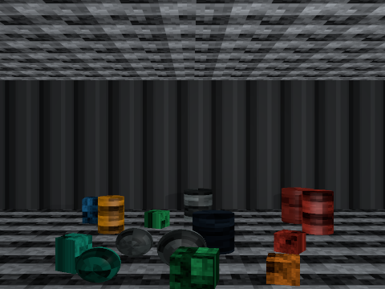<br><sub>Left image <code>left.png</code></sub></td>
    <td align="center" width="50%">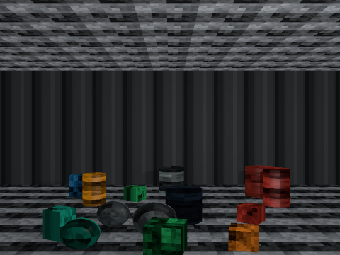<br><sub>Right image <code>right.png</code>. Baseline shift along x only.</sub></td>
  </tr>
</table>

It also outputs `truth.txt`: focal length, baseline, per-object depth and disparity. The camera-space convention matches r3d's `Depth` (left image first; rectified disparity is x-only). `stereo` / `depth` can read these directly.

```bash
cargo run --release -p cga-examples --bin stereo_pair -- 7 examples/stereo 480 360 0.10
```

## Known limitations (gap vs three.js)

- **Shadows**: one occlusion ray per light (hard shadows). No soft shadows. No post-processing. No tonemap. No envMap/IBL. High-metalness materials render dark. The demos therefore lower metalness.
- **Textures**: `material(map=...)` does analytic UV sampling. No mipmap. No filtering control.
- **scale/mirror**: connected through the AffineGeometry ray inverse transform. Versors cannot express them. Blade semantics (meet/incidence predicates) do not apply to affinely deformed primitives.
- **CSG**: classification uses intervals between crossings (no δ sampling). Tangencies/multiple roots take the discriminant-exact path. Undecidable cases report `Unknown` explicitly; no silent guessing. One material per node. `circle` is not a solid.
- **Non-blade primitives**: cone/torus/ellipsoid/cyclide/mesh connect through ray inverse transforms. The ring cyclide is a smooth genus-1 surface. The spindle type self-intersects; CSG membership semantics degrade.
- **Mesh**: brute-force O(N·F). No BVH. Flat normals. No texture coordinates. glTF import is currently limited to a single primitive. Inside/outside classification uses the generalized winding number: open meshes and globally reversed orientation work; mixed orientation is meaningless. In CSG composition, `contains` and `crossings` both evaluate in chunks under a 256 MB temporary budget (prevents OOM, at the cost of per-chunk GPU sync).
- **Precision**: the algebra core is always CPU float64. The render kernels are float32 (MLX/Metal have no float64). Parameters end up near the origin after entering camera space.

## Potential robotics applications

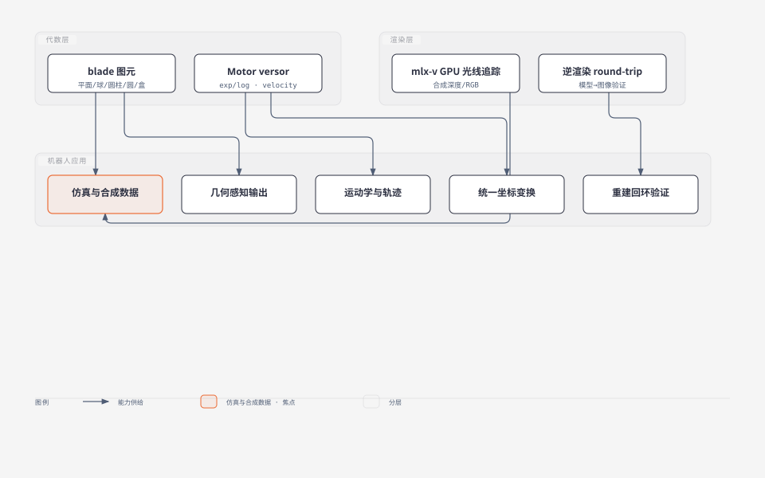

| Direction | Basis |
| --- | --- |
| Simulation and synthetic data | Ray-traced synthetic depth/RGB. Changing the viewpoint only requires resetting the camera motor. Suited for domain-randomized batch generation (with exact depth ground truth). |
| Kinematics and trajectories | A motor is the versor representation of SE(3). `exp`/`log`/`velocity_bivector`/`interpolate` already exist. `motor = exp(s·log(M₀·M₁⁻¹))` generates smooth rigid-body paths. |
| Geometry-aware output | A primitive blade is the semantic of the manipulated object. A plane normal = the grasp pose z axis. A cylinder axis + radius = the gripper opening. |
| Reconstruction loop verification | Render the reconstructed scene back to the original viewpoint. Depth comparison against the original frame detects drift. |
| Unified coordinate transforms | Camera, robot arm, and workpiece share one algebra. Chained multi-frame transforms converge to one representation. |

## Project layout

```text
crates/
  cga-core/                 pure f64 CPU algebra core
    multivector / tables    32-component MVP + GP product tables (generated by gen_tables.py)
    motors / primitives     motors, primitive incidence predicates and distances
    cyclide / geometry      Dupin cyclide, Geometry and camera parameters
    affine / affine_geom    affine extension (scale/mirror inverse transform + Newton polar decomposition)
    csg_node / modeling     CSG tree, ear-clipping triangulation + extrude + loft
    bake / mesh_io / gif    mesh baking (marching tetrahedra), OBJ, GIF89a encoding
  cga-gpu/                  mlx-rs/Metal GPU kernels
    mlxops / shading        scalar broadcast helpers, material lights and batched Blinn-Phong
    scene / scene_graph     Mesh·Scene·PerspectiveCamera·OrbitControls, Vec3/Color
    geometry_ops / geometry_extra / geom_kernels   blade analytic intersection (incl. cone/torus/ellipsoid/cyclide)
    trimesh / csg / certify intersection, recursive CSG, certifiable root-finding and interval classification
    texture / image_io / shading / mesh_raster     textures, PNG, CPU raster compositing
    mesh_io_gltf            glTF/GLB read/write
    scene_build / scene_report / jsx_gen / headless scene builders, report, JSX generation, headless rendering
    urdf                    URDF export/import (jsx_to_urdf / urdf_to_jsx, urdf-rs)
    jsx                     JSX+CSS scene host (swc compile → boa execute → CgsRun)
    renderer                mlx-rs GPU batched ray tracing (SSAA/hard shadows/Whitted refraction)
  cga-examples/             demo CLIs (src/bin/*.rs)
examples/                   .cgs scenes (incl. primitives/affine/assembly/freeform) + jsx/ React-style scenes + assets textures + demo output images (README figures; bake/lang are the P4 and generation-pipeline showcases)
docs/                       architecture diagram, robotics diagram, cross-platform plan
```

Demo CLIs (`cargo run --release -p cga-examples --bin <name>`):

| CLI | Output |
| --- | --- |
| `demo_engine [frames]` | `examples/engine/orbit.gif` |
| `demo_advantage` | `examples/advantage/advantage_{a,b,c}.png` three panels |
| `demo_kinematics` | `examples/kinematics/kinematics.gif` |
| `demo_csg` | `examples/csg/demo_csg.png` (union/difference/intersection side by side) |
| `demo_bake` | `examples/bake/demo_bake.{png,obj}` (implicit CSG and watertight baked mesh side by side) |
| `demo_lang` | `examples/lang/{generated_flange.jsx, demo_lang.png, report.txt}` (generate → headless render → report) |
| `demo_gltf` | `examples/gltf/demo_gltf.{glb,png}` |
| `demo_helmet` | `examples/helmet/demo_helmet.png` |
| `render_jsx <file.jsx> [out.png] [w h aa]` | JSX(+CSS) → PNG |
| `bake_jsx <file.jsx> [out.obj\|out.glb] [step]` | JSX → triangle mesh (unbounded planes are skipped automatically) |
| `report_jsx <file.jsx> [--set name=value]` | JSX → scene report (stdout line-by-line assertable text; errors go to stderr, exit 1) |
| `stereo_pair [seed] [out_dir] [w h] [baseline]` | `left.png` / `right.png` / `truth.txt` stereo pair |

## Quality

- `make test`: **all 196 tests pass** (cga-core 61 + cga-gpu 135, no `#[ignore]`). Coverage: algebraic identities, primitive incidence predicates, versor exp-log round trips, anti-aliasing, quantitative engine rendering, CSG, affine, new primitives, cyclide, mesh interop (winding-number classification: open meshes, globally reversed, chunking consistency for `contains` and `crossings`), certified f64 fallback for the f32 crossing guards (sphere/cylinder/cone/ellipsoid discriminants, torus/cyclide quartics, near-parallel planes), scale-relative CSG UV probes, the JSX+CSS host (gallery smoke, components, control flow, CSS materials, joints/gear, solve, pose), the builder layer (geometry/material/validation), joints (P1 six-type poses and nesting, P2 gear coupling, P3 cam contact solving, P1.1 rpy frames, P4 pose overrides), URDF export/import round trips, scene reports, the freeform degenerate-case library + interval classification + certifiable root-finding + Bézier patch leaves (evaluation/chord-height bound/watertight shell/CSG/bake volume), baked volume and watertight topology (boundary edges/non-manifold edges/Euler characteristic) goldens.
- Render goldens are written to `artifacts/tests/` (gitignored). The sphere/cone/ellipsoid/cyclide/torus/textured_box/helmet/csg goldens have **RMSE = 0**.

## License

MIT. See [LICENSE](LICENSE).
